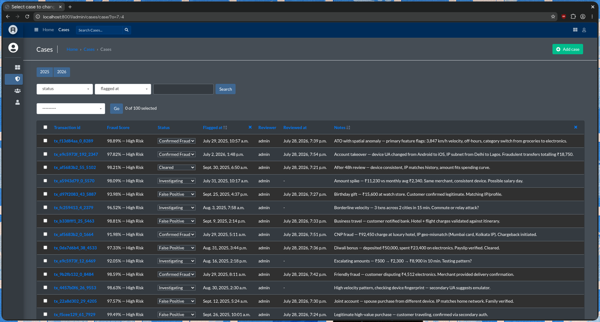
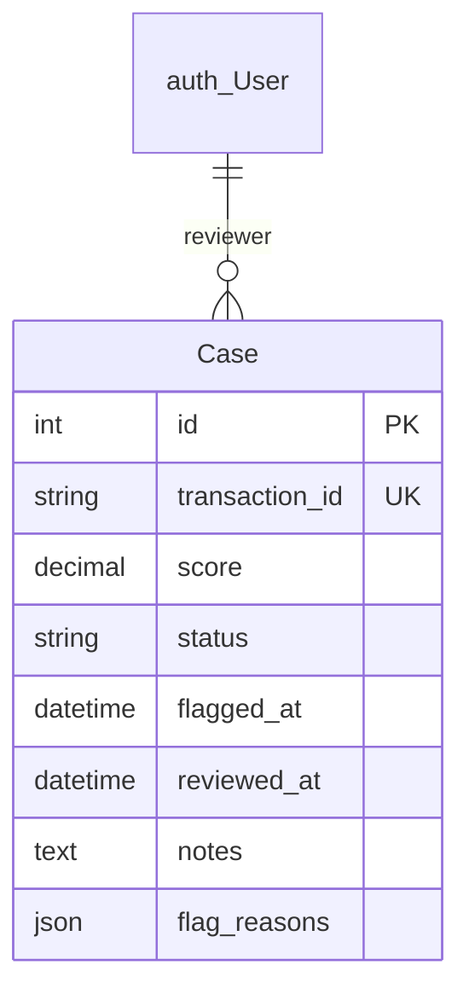

# Django Case Management UI

## Overview
The `case_admin/` Django app provides the OLTP case management interface. It consumes flagged transactions from `ingest_cases.py` and surfaces them as reviewable cases with status workflows, score visualizations, and SHAP-driven flag indicators. Runs as the `case-admin` Docker service (port `8000`→host `8001`), backed by `oltp-postgres` on `5432`→host `5433`.

**Figure 9:** Case Admin Interface — Django admin list view showing cases with status workflow, score badges, and flag indicators.

## Schema

**Figure 10:** Case Management Entity Schema

| Field | Type | Notes |
| :--- | :--- | :--- |
| `id` | `AutoField` | Primary key |
| `transaction_id` | `CharField` | Unique reference to streaming transaction UUID |
| `score` | `DecimalField` | Fraud probability (4 decimal places) |
| `status` | `CharField` | `CaseStatus` enum, indexed |
| `flagged_at` | `DateTimeField` | Flag timestamp, indexed, defaults to `timezone.now` |
| `reviewer` | `ForeignKey(auth.User)` | Assigned analyst, nullable |
| `reviewed_at` | `DateTimeField` | Review completion timestamp, nullable |
| `notes` | `TextField` | Free-text investigation notes, nullable |
| `flag_reasons` | `JSONField` | SHAP features / rule triggers, nullable |

**Status workflow:** `pending → investigating → confirmed_fraud | cleared | false_positive`. Terminal states reject further transitions. Invalid transitions raise `ValidationError`.

## Architecture

### Score Visualization
`score_badge()` color-codes in admin list: red (≥0.90), orange (≥0.70), green (<0.70). `flag_reasons_rendered()` renders SHAP/rule triggers as an HTML table.

### Reviewer Auto-Assignment
`save_model()` auto-assigns the current user as reviewer on first edit and sets `reviewed_at` to `timezone.now`.

### Dashboard Statistics
Admin index shows real-time case counts by status and a false positive rate: `false_positives / (confirmed + false_positives) × 100`.

## Current Limitations

Status transition validation only runs when `self.pk is not None` — new objects before initial save bypass it. Safe in practice because `create()` always sets `status=pending`.
