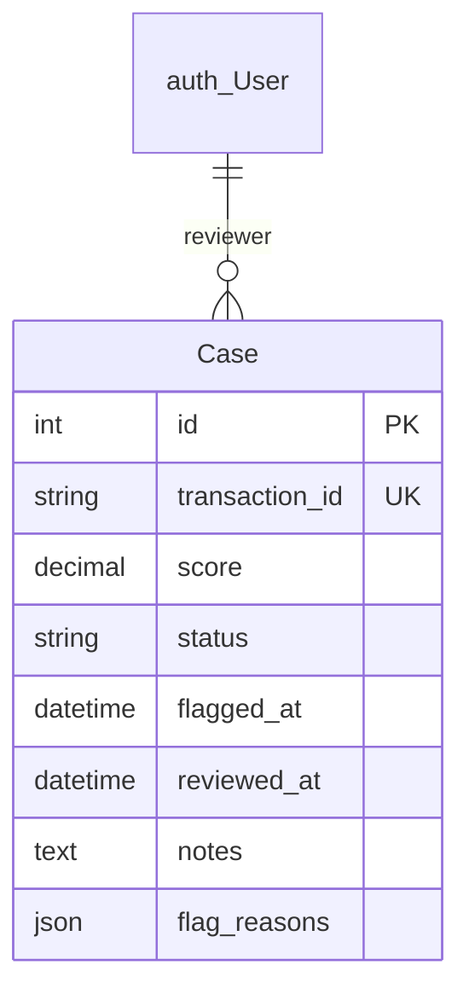

# Django Case Management UI

## Overview
The `case_admin/` Django application provides the OLTP case management interface for fraud analysts. It consumes fraud-scored transactions from the real-time scorer pipeline via `src/ml/ingest_cases.py` and presents them as reviewable cases with status workflows, score visualizations, and SHAP-driven flag indicators. The application runs as a Docker service (`case-admin` in `docker-compose.yml`, built from `case_admin/Dockerfile`) and connects to the OLTP Postgres database (`oltp-postgres`) internally on port `5432`, exposed on the host at `5433`. The web UI is exposed on the host at `8001` (container port `8000`).

## Schema

The `Case` model references a transaction from the streaming pipeline and links to a Django `auth.User` as reviewer:

<code>Case</code>

| Field Name | Type | Description |
| :--- | :--- | :--- |
| `id` | `AutoField` | Auto-incrementing primary key. |
| `transaction_id` | `CharField` | Reference to the transaction UUID from the streaming pipeline. Enforced unique. |
| `score` | `DecimalField` | Fraud probability score from the XGBoost model, stored as 4-decimal-place value. |
| `status` | `CharField` | Current review status from `CaseStatus` enum: `pending`, `investigating`, `confirmed_fraud`, `cleared`, or `false_positive`. Indexed. |
| `flagged_at` | `DateTimeField` | Timestamp when the scorer flagged this transaction. Indexed, defaults to `timezone.now`. |
| `reviewer` | `ForeignKey` | FK to `auth.User`. The analyst assigned to the case. Nullable, set on first save. |
| `reviewed_at` | `DateTimeField` | Timestamp when the review was completed. Nullable. |
| `notes` | `TextField` | Free-text investigation notes from the analyst. Nullable. |
| `flag_reasons` | `JSONField` | Structured data from the scoring pipeline — typically SHAP top features or rule triggers. Nullable. |

<code>CaseStatus</code>

| Choice | Description |
| :--- | :--- |
| `pending` | Initial state for all newly ingested cases. |
| `investigating` | Actively under analyst review. |
| `confirmed_fraud` | Analyst confirmed as fraud. Terminal state. |
| `cleared` | Analyst found no evidence of fraud. Terminal state. |
| `false_positive` | Explicitly marked as a model false positive. Terminal state. |

The `Case` model is defined in `case_admin/cases/models.py`, the admin interface in `case_admin/cases/admin.py`, and the database migrations in `case_admin/cases/migrations/0001_initial.py` and `case_admin/cases/migrations/0002_case_reviewer_alter_case_score_and_more.py`.

**Status Transition Enforcement** is implemented via `ALLOWED_TRANSITIONS` in `models.py`. Only `pending → investigating` is valid for the initial transition. From `investigating`, the case can move to `confirmed_fraud`, `cleared`, or `false_positive`. All three terminal states reject further transitions via `clean()` validation. Attempting an invalid transition raises a `ValidationError` with an explicit list of allowed next states.

**Reviewer Auto-Assignment** is handled in the admin's `save_model()` method. When a case is modified (`change=True`) and has no existing reviewer, the current authenticated user is automatically assigned as the reviewer and the `reviewed_at` timestamp is set to `timezone.now`. This ensures audit trail completeness without requiring the analyst to manually set their own name on every case.

**Score Visualization** is provided by the `score_badge()` method in `CaseAdmin`. Scores are color-coded in the admin list view: red (≥0.90, High Risk), orange (≥0.70, Medium Risk), or green (<0.70, Low Risk). The raw score is displayed as a percentage alongside the risk label. The `flag_reasons_rendered()` method renders the `flag_reasons` JSON into an HTML table showing each SHAP feature or rule trigger with its value — amounts are formatted as currency, and boolean triggers display as colored badges.

**Dashboard Statistics** are computed in `RiskFabricAdminSite.index()`. The admin index page displays real-time case counts by status, total cases, and a false positive rate calculated as `false_positives / (confirmed + false_positives) × 100`. These values are injected into the template context on every dashboard load.

`case_admin` sits at the endpoint of the scoring pipeline. It receives data from `src/ml/ingest_cases.py`, which reads flagged transactions from either ClickHouse's `fraud_scores` table or falls back to the Parquet output. The application runs as the `case-admin` Docker service (built from `case_admin/Dockerfile`), alongside the `oltp-postgres` service, exposing the web UI on the host at `8001` (container port `8000`), and is initialized by `case_admin/entrypoint.sh` which performs DB wait, migration, superuser creation, and gunicorn startup.

## Known Issues
The `ingest_cases.py` script creates its own `cases` table with a raw SQL `CREATE TABLE IF NOT EXISTS` statement. This is redundant with the Django-managed migration (`0001_initial.py`) and creates a risk of schema drift between the script's table creation and the actual Django model. The script also uses a different column name (`reviewed_by` instead of `reviewer_id`) and `DOUBLE PRECISION` instead of `DECIMAL(5,4)`. Standardizing on the Django migration as the single source of schema truth would eliminate this possible inconsistency.

Status transition validation only runs when `self.pk is not None` — this means transitions on newly created objects (before initial save) silently bypass validation. In practice this is not triggered because `Case.objects.create()` always sets `status=pending`, but a direct attribute set on a new instance could circumvent the transition guard.

The dashboard index view silently catches and discards all exceptions with `except Exception as e: print(...)`. If the `cases` table does not exist or Postgres is unreachable, the admin index loads without statistics rather than surfacing the error.
