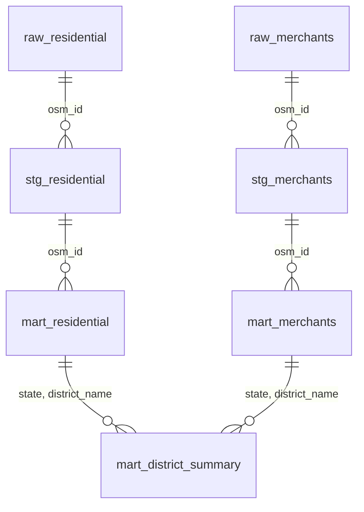

# Geospatial Reference Pipeline

## Overview

The `warehouse/` directory contains the dbt project that transforms raw OSM staging tables into the geographic reference data consumed by the simulation generators. It operates on Postgres with PostGIS and takes `raw_residential`, `raw_merchants`, and `raw_financial` — populated by `prepare_refs.rs` — as its sources, producing three materialized mart tables (`mart_residential`, `mart_merchants`, `mart_district_summary`) that are serialized to Parquet by `export_references.rs`. The project contains two staging models, three mart models, and one macro.

## Schema

The dbt project reads the three `raw_*` staging sources and produces two staging models and three mart tables. The marts are exported to Parquet for the simulation generators:

<code>stg_residential</code>

| Field Name | Type | Description |
| :--- | :--- | :--- |
| `osm_id` | `BIGINT` | OSM node identifier, carried from `raw_residential`. |
| `h3_index` | `TEXT` | H3 index at Resolution 8, carried from `raw_residential`. |
| `latitude` | `DOUBLE PRECISION` | Latitude coordinate. |
| `longitude` | `DOUBLE PRECISION` | Longitude coordinate. |
| `city` | `TEXT` | Raw city name from the `addr:city` OSM tag. |
| `postcode` | `TEXT` | Raw postal code from the `addr:postcode` OSM tag. |
| `state_standardized` | `TEXT` | State name normalized via a left join against `ref_state_map`; falls back to the raw `addr:state` value, then `'Unknown'`, if no mapping exists. |

<code>stg_merchants</code>

| Field Name | Type | Description |
| :--- | :--- | :--- |
| `osm_id` | `BIGINT` | OSM node identifier, carried from `raw_merchants`. |
| `h3_index` | `TEXT` | H3 index at Resolution 8, carried from `raw_merchants`. |
| `merchant_name` | `TEXT` | Merchant name from the `name` OSM tag. |
| `latitude` | `DOUBLE PRECISION` | Latitude coordinate. |
| `longitude` | `DOUBLE PRECISION` | Longitude coordinate. |
| `city` | `TEXT` | Raw city name from the `addr:city` OSM tag. |
| `postcode` | `TEXT` | Raw postal code from the `addr:postcode` OSM tag. |
| `state` | `TEXT` | Raw state name from the `addr:state` OSM tag. |
| `merchant_category` | `TEXT` | Standardized RiskFabric category joined from `ref_category_map` on `sub_category`; defaults to `'GENERAL_RETAIL'` if no mapping exists. |
| `risk_level` | `TEXT` | Risk classification joined from `ref_category_map`; defaults to `'LOW'` if no mapping exists. |

<code>mart_residential</code>

| Field Name | Type | Description |
| :--- | :--- | :--- |
| `osm_id` | `BIGINT` | OSM node identifier. |
| `h3_index` | `TEXT` | H3 index at Resolution 8. |
| `latitude` | `DOUBLE PRECISION` | Latitude coordinate. |
| `longitude` | `DOUBLE PRECISION` | Longitude coordinate. |
| `city` | `TEXT` | City name after applying the `normalize_city` macro. |
| `pincode` | `TEXT` | Postal code with all non-digit characters stripped via `regexp_replace`. |
| `state` | `TEXT` | Official state name derived from a PostGIS `ST_Intersects` join against `ref_boundaries_states` (DataMeet boundaries). |
| `district_name` | `TEXT` | Official district name derived from a PostGIS `ST_Intersects` join against `ref_boundaries_districts` (DataMeet boundaries). |

<code>mart_merchants</code>

| Field Name | Type | Description |
| :--- | :--- | :--- |
| `osm_id` | `BIGINT` | OSM node identifier. |
| `h3_index` | `TEXT` | H3 index at Resolution 8. |
| `latitude` | `DOUBLE PRECISION` | Latitude coordinate. |
| `longitude` | `DOUBLE PRECISION` | Longitude coordinate. |
| `merchant_name` | `TEXT` | Merchant name. |
| `merchant_category` | `TEXT` | Standardized RiskFabric category (e.g., `'GENERAL_RETAIL'`, `'JEWELRY'`, `'ELECTRONICS'`). |
| `risk_level` | `TEXT` | Risk classification assigned to the merchant category (e.g., `'LOW'`, `'MEDIUM'`, `'HIGH'`, `'VERY_HIGH'`). |
| `city` | `TEXT` | City name after applying the `normalize_city` macro. |
| `pincode` | `TEXT` | Postal code with all non-digit characters stripped. |
| `state` | `TEXT` | Official state name from PostGIS spatial join. |
| `district_name` | `TEXT` | Official district name from PostGIS spatial join. |

<code>mart_district_summary</code>

| Field Name | Type | Description |
| :--- | :--- | :--- |
| `state` | `TEXT` | State name, coalesced from residential and merchant aggregations. |
| `district_name` | `TEXT` | District name, coalesced from residential and merchant aggregations. |
| `residential_nodes` | `INTEGER` | Count of residential nodes in the district from `mart_residential`. |
| `merchant_nodes` | `INTEGER` | Count of merchant nodes in the district from `mart_merchants`. |
| `high_risk_merchants` | `INTEGER` | Count of merchants with `risk_level = 'VERY_HIGH'`. |
| `medium_high_risk_merchants` | `INTEGER` | Count of merchants with `risk_level = 'HIGH'`. |
| `merchant_to_residential_ratio` | `NUMERIC` | Merchant node count divided by residential node count, rounded to 2 decimal places; 0 if no residential nodes exist. |

**Spatial Join Strategy** is the core mechanism used in both mart models to assign authoritative state and district names. Rather than trusting the `addr:state` OSM tag — which is inconsistently populated and contains a wide variety of spelling and transliteration variants — both `mart_residential` and `mart_merchants` perform `ST_Intersects` operations against official administrative boundary geometries sourced from DataMeet (`ref_boundaries_states` and `ref_boundaries_districts`). Every coordinate is point-in-polygon tested against both boundary layers, producing a verified `state` and `district_name` for each node regardless of what its OSM address tags contain.

**Category and Risk Mapping** is handled in `stg_merchants` via a seed-driven lookup table (`ref_category_map`). Raw OSM `sub_category` values (e.g., `"jewelry"`, `"electronics"`, `"fast_food"`) are joined against this map to produce a standardized `merchant_category` and a `risk_level` classification. Unmatched sub-categories default to `'GENERAL_RETAIL'` / `'LOW'`. This separates risk assignment logic from the Rust simulation binaries — the fraud engine selects high-risk merchants by filtering on `risk_level` in the Parquet file rather than embedding category-level risk decisions in generated code.

**City Normalization** is applied uniformly across both mart models via the `normalize_city` macro. The macro applies three sequential transformations: it strips common appended state or city names (e.g., `" PUNE"`, `" TELANGANA"`) via regex, takes the substring before the first dash to remove postal suffix patterns (e.g., `"Secunderabad-26" → "Secunderabad"`), and takes the substring before the first comma to drop compound address fragments. The result is uppercased and trimmed. This is a best-effort heuristic rather than a validated normalization — see Known Issues.

**Btree Indexes** are declared on all columns used for joins or filtering by downstream processes. `mart_residential` indexes `state`, `district_name`, `h3_index`, and `pincode`. `mart_merchants` adds `merchant_category` to those four. These are applied by dbt at materialization time and are the primary mechanism for keeping `export_references.rs` query times proportional to result set size rather than total table size.

`warehouse/` sits between the **Staging layer** (`raw_*` tables populated by `prepare_refs.rs`) and the **Generation layer** (Parquet files consumed by `generate.rs`, `stream.rs`, and `customer_gen.rs`). It must be run after `prepare_refs.rs extract-nodes` completes and before `export_references.rs` is invoked.

## Known Issues

The `ST_Intersects` spatial joins in `mart_residential` and `mart_merchants` execute against the full geometry of every boundary polygon on every dbt run. There is no spatial index configured on the `ref_boundaries_states` or `ref_boundaries_districts` source tables in the dbt project, meaning the join cost scales with the product of node count and boundary polygon count. For the full India OSM dataset this makes mart materialization significantly slower than the staging layer. Adding a `GIST` index on the geometry columns of both boundary source tables would reduce join time substantially.

The `normalize_city` macro applies a hardcoded list of state and city names to strip from city strings (`MAHARASHTRA`, `TELANGANA`, `KARNATAKA`, `TAMIL NADU`, `PUNE`, `HYDERABAD`, `BENGALURU`). This list is incomplete — any state or major city not enumerated will pass through uncleaned. Additionally, the macro cannot handle transliteration errors or Devanagari script variants present in raw Indian OSM data. The spatial join in the mart models already provides authoritative state and district assignments, making the city field a best-effort label rather than a reliable grouping key. A dedicated geographic gazetteer or fuzzy matching approach is needed if city-level clustering is required downstream.

`mart_district_summary` is not consumed by any downstream pipeline component — `export_references.rs` only exports `mart_residential` and `mart_merchants`. It exists as a diagnostic and validation table to inspect district-level coverage and merchant density before committing a reference dataset to simulation. It has no automated validation checks (e.g., assert that all districts have at least one residential node), so gaps in OSM coverage are not surfaced unless the table is manually queried.
