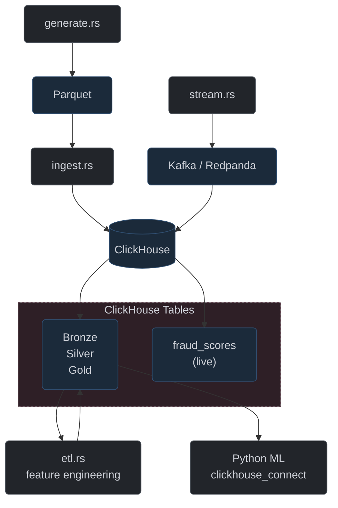

# ClickHouse Batch ETL Architecture (Defunct)

**Status:** Superseded by the Parquet-only pipeline per the [Storage Architecture Split](../decisions/storage_architecture_split.md) decision (2026-07-16).

**Current replacement:** Batch ETL reads and writes Parquet files directly. DuckDB (embedded, no server) queries Gold snapshots for ML training. ClickHouse retained only for the live streaming `fraud_scores` path.

---

## What it was

ClickHouse served as the central analytical store for the entire pipeline — batch training and streaming scoring ran through the same database. The architecture had three roles for ClickHouse:

1. **Batch ETL store:** Bronze transactions were ingested from Parquet into `fact_transactions_bronze` via `src/bin/ingest.rs`. Feature engineering (`src/bin/etl.rs`) read from ClickHouse Bronze/Silver tables using the native `clickhouse` Rust client (HTTP interface), computed features in Rust/Polars, and wrote Silver and Gold tables back to ClickHouse.

2. **Training data source:** Python ML scripts (`train_xgboost.py`, `calibrate_model.py`, `shap_analysis.py`, etc.) connected to ClickHouse via `clickhouse_connect` to query `fact_transactions_gold` for training, calibration, and evaluation.

3. **Streaming scores:** Real-time scored transactions streamed into `fraud_scores_final` via the Redpanda → scorer path. Dashboard and monitoring queries ran against ClickHouse.

## Architecture diagram (defunct)

**Figure 15:** ClickHouse Batch ETL Architecture (Defunct)

## Tables (defunct)

| Table | Purpose | Created by |
|---|---|---|
| `fact_transactions_bronze` | Raw ingested transactions | `ingest.rs` |
| `fact_transactions_silver` | Feature-engineered transactions | `etl.rs silver` |
| `customer_features_silver` | Customer-level aggregates | `etl.rs silver-customers` |
| `merchant_features_silver` | Merchant-level aggregates | `etl.rs silver-merchants` |
| `fact_transactions_gold` | Joined master training table | `etl.rs gold-master` |
| `training_snapshots` | Timestamped training set copies | `snapshot_training.py` |
| `fraud_scores_final` | Real-time scored transactions | Streaming pipeline |

## Rust code (removed)

- `src/clickhouse/mod.rs`, `src/clickhouse/client.rs`, `src/clickhouse/types.rs` — native ClickHouse HTTP client using the `clickhouse` crate for async batch inserts and queries
- `src/bin/ingest.rs` — standalone binary that read `data/output/transactions.parquet` and bulk-inserted into ClickHouse Bronze
- `src/etl/gold/gold_master.rs` — Gold join logic that queried ClickHouse Silver tables and wrote back to ClickHouse
- `src/summary/clickhouse.rs` — summary/analytics module that queried ClickHouse for dashboard statistics
- `Cargo.toml` — dependency on `clickhouse` crate (removed)

## Python code (replaced)

All ClickHouse Python clients were replaced with DuckDB:

| Script | Old | New |
|---|---|---|
| `train_xgboost.py` | `clickhouse_connect.get_client()` | `ml_utils.load_gold_dataframe()` |
| `calibrate_model.py` | direct `clickhouse_connect` query | `ml_utils.load_gold_dataframe()` |
| `compute_thresholds.py` | `clickhouse_connect` query | `ml_utils.load_gold_dataframe()` |
| `shap_analysis.py` | `clickhouse_connect` query | `ml_utils.load_gold_dataframe()` |
| `test_model.py` | `clickhouse_connect` query | `ml_utils.load_gold_dataframe()` |
| `drift_simulation.py` | `clickhouse_connect` query | `ml_utils.load_gold_dataframe()` |
| `verify_leakage.py` | `clickhouse_connect` query | `ml_utils.load_gold_dataframe()` |
| `evaluate_model_depth.py` | `clickhouse_connect` query | `ml_utils.load_gold_dataframe()` |
| `local_shap_explanation.py` | `clickhouse_connect` query | `ml_utils.load_gold_dataframe()` |
| `seed_redis.py` | `clickhouse_connect` query | `ml_utils.load_gold_dataframe()` |
| `generate_1m_transactions.py` | `clickhouse_connect` query | `ml_utils.load_gold_dataframe()` |

## Why it was replaced

The batch ETL and training pathway did a wasteful round-trip: Parquet → ClickHouse insert → ClickHouse query → Polars compute → ClickHouse write → Python ClickHouse query → model. The ClickHouse overhead (HTTP serialization, table scans through MergeTree, connection management) added latency and operational complexity without providing any benefit for this workload. Full-table scans of Parquet files are faster via DuckDB's in-process engine, and Parquet snapshots provide immutable versioned releases of each training dataset — a stronger guarantee than mutable ClickHouse tables.

ClickHouse excels at the streaming path (append-only inserts, real-time aggregations, dashboard queries against recent windows) and was kept for that purpose only.

## Docker infrastructure (defunct)

- `docker/clickhouse/init.sql` — originally created Bronze, Silver, Gold, and `fraud_scores_final` tables at startup. Now only creates `fraud_scores`.
- `docker-compose.yml` — ClickHouse service still runs for the streaming path only.
