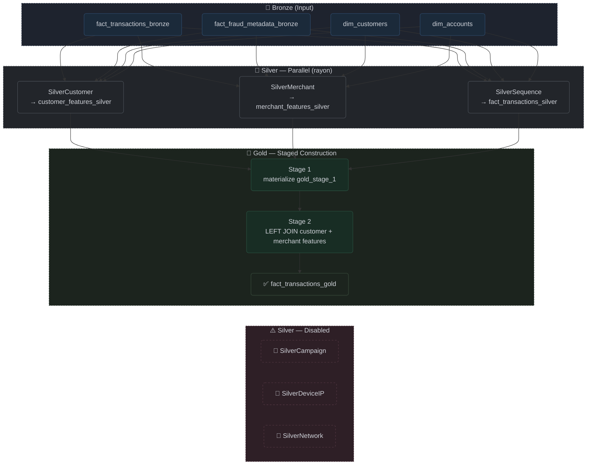

# ETL Pipeline System (Shell-Pivot Variant)

> DEFUNCT. This document describes the superseded implementation that routed all ClickHouse I/O through `podman exec clickhouse-client` shell pipelines. The active implementation now uses the native `clickhouse` Rust crate and is documented in [ETL Pipeline System](etl_system.md). Retained for historical reference and audit.

## Overview

The ETL pipeline system (`etl.rs` and `src/etl/`) is the transformation engine that converts raw Bronze-level data into ML-ready features. It reads `fact_transactions_bronze`, `fact_fraud_metadata_bronze`, `dim_customers`, and `dim_accounts` from ClickHouse via `podman exec` calls, applies subject-specific feature engineering in Rust using `polars` lazy evaluation, and writes the resulting Silver and Gold tables back to ClickHouse. The pipeline is invoked as a standalone binary (`riskfabric-etl`) with individual subcommands per stage, and is consumed downstream by the Python-based ML training pipeline.

## Schema

### `customer_features_silver`

| Field Name | Type | Description |
| :--- | :--- | :--- |
| `customer_id` | `String` | UUID v4 link to the parent customer profile. |
| `name` | `String` | Customer name, carried over from `dim_customers`. |
| `email` | `String` | Customer email, carried over from `dim_customers`. |
| `account_count` | `UInt32` | Total number of accounts owned by the customer, aggregated from `dim_accounts`. |
| `total_transactions` | `UInt32` | Total count of transactions attributed to the customer. |
| `total_fraud_transactions` | `UInt32` | Count of transactions where `is_fraud = 1`. |
| `fraud_rate` | `Float64` | Ratio of fraudulent to total transactions (`total_fraud_transactions / total_transactions`). |
| `avg_transaction_amount` | `Float64` | Mean transaction amount across all customer transactions. |
| `night_transaction_ratio` | `Float64` | Proportion of transactions occurring between 22:00 and 06:00 UTC. |
| `weekend_transaction_ratio` | `Float64` | Proportion of transactions occurring on Saturday or Sunday. |
| `first_transaction_ts` | `Nullable(DateTime64(3, 'UTC'))` | Timestamp of the customer's earliest recorded transaction. |
| `last_transaction_ts` | `Nullable(DateTime64(3, 'UTC'))` | Timestamp of the customer's most recent recorded transaction. |

### `merchant_features_silver`

| Field Name | Type | Description |
| :--- | :--- | :--- |
| `merchant_id` | `String` | Unique identifier of the merchant. |
| `merchant_name` | `String` | Name of the merchant, carried over from `fact_transactions_bronze`. |
| `merchant_category` | `String` | Category classification of the merchant. |
| `total_transactions` | `UInt32` | Total count of transactions processed by the merchant. |
| `total_amount` | `Float64` | Sum of all transaction amounts at this merchant. |
| `avg_transaction_amount` | `Float64` | Mean transaction amount at this merchant. |
| `total_fraud_transactions` | `UInt32` | Count of fraudulent transactions processed by the merchant. |
| `merchant_fraud_rate` | `Float64` | Ratio of fraudulent to total transactions (`total_fraud_transactions / total_transactions`). |

### `fact_transactions_silver`

| Field Name | Type | Description |
| :--- | :--- | :--- |
| `transaction_id` | `String` | UUID v4 identifying the transaction. |
| `card_id` | `String` | UUID v4 link to the associated card entity. |
| `account_id` | `String` | UUID v4 link to the associated account entity. |
| `customer_id` | `String` | UUID v4 link to the associated customer profile. |
| `merchant_id` | `String` | Unique identifier of the merchant. |
| `merchant_category` | `String` | Category classification of the merchant. |
| `amount` | `Float64` | Transaction monetary value. |
| `timestamp` | `DateTime64(3, 'UTC')` | UTC timestamp of the transaction in millisecond precision. |
| `transaction_channel` | `String` | Channel used for the transaction (e.g., `"POS"`, `"Online"`, `"ATM"`). |
| `card_present` | `UInt32` | Flag (0 or 1) indicating if the physical card was present. |
| `user_agent` | `String` | User Agent string recorded for the transaction. |
| `ip_address` | `String` | IP address of the client device. |
| `is_fraud` | `UInt32` | Ground truth fraud label (0 or 1). |
| `time_since_last_transaction` | `Float64` | Elapsed time in seconds since the customer's previous transaction; null for the first transaction. |
| `transaction_sequence_number` | `UInt32` | Cumulative count of transactions for this customer, ordered by timestamp. |
| `hours_since_midnight` | `Float64` | Fractional hour of the transaction within the day (e.g., 13.5 = 13:30). |
| `is_weekend` | `UInt32` | Flag (0 or 1) indicating if the transaction occurred on Saturday or Sunday. |
| `spatial_velocity` | `Float64` | Estimated travel speed in km/h between the current and previous transaction location; capped at 10,000 km/h to suppress infinite values. |
| `hour_deviation_from_norm` | `Float64` | Absolute deviation of the transaction hour from the customer's mean transaction hour. |
| `amount_round_number_flag` | `UInt32` | Flag (0 or 1) set when the amount is divisible by 1, 5, or 10 — a known carding heuristic. |
| `amount_deviation_z_score` | `Float64` | Z-score of the transaction amount relative to the customer's historical mean and standard deviation; 0 when undefined. |
| `rapid_fire_transaction_flag` | `UInt32` | Flag (0 or 1) set when `time_since_last_transaction` is 300 seconds (5 minutes) or less. |
| `escalating_amounts_flag` | `UInt32` | Flag (0 or 1) set when the previous two transactions show a strictly increasing amount pattern. |
| `merchant_category_switch_flag` | `UInt32` | Flag (0 or 1) set when the merchant category differs from the immediately preceding transaction. |
| `fraud_target` | `UInt32` | Ground truth fraud target label from `fact_fraud_metadata_bronze`. |
| `fraud_type` | `String` | Type classification of injected fraud (e.g., `"Simulated Compromise"`, `"Carding"`); `"none"` for legitimate transactions. |
| `geo_anomaly` | `UInt32` | Flag (0 or 1) from fraud metadata indicating a geographic anomaly was injected. |
| `device_anomaly` | `UInt32` | Flag (0 or 1) from fraud metadata indicating a device anomaly was injected. |
| `ip_anomaly` | `UInt32` | Flag (0 or 1) from fraud metadata indicating an IP anomaly was injected. |
| `campaign_id` | `Nullable(String)` | UUID of the fraudulent campaign the transaction belongs to; null for non-campaign transactions. |

### `fact_transactions_gold`

| Field Name | Type | Description |
| :--- | :--- | :--- |
| *(All columns from `fact_transactions_silver`)* | — | All sequence features are inherited directly from the Silver table. |
| `cf_fraud_rate` | `Float64` | Customer-level fraud rate, joined from `customer_features_silver`. |
| `cf_night_tx_ratio` | `Float64` | Customer-level night transaction ratio, joined from `customer_features_silver`. |
| `mf_fraud_rate` | `Float64` | Merchant-level fraud rate, joined from `merchant_features_silver`. |
| `ip_fraud_rate` | `Float64` | IP reputation score; currently hardcoded to `0.0` (Network stage disabled). |
| `ip_degree` | `UInt32` | Number of unique customers sharing this IP; currently hardcoded to `0` (Network stage disabled). |
| `dev_fraud_rate` | `Float64` | Device reputation score; currently hardcoded to `0.0` (Network stage disabled). |
| `dev_degree` | `UInt32` | Number of unique customers sharing this device fingerprint; currently hardcoded to `0` (Network stage disabled). |
| `suspicious_cluster_member` | `UInt32` | Network cluster fraud flag; currently hardcoded to `0` (Network stage disabled). |
| `campaign_txn_count` | `UInt32` | Transaction count within the fraud campaign; currently hardcoded to `0` (Campaign stage disabled). |
| `campaign_total_amount` | `Float64` | Total amount transacted in the fraud campaign; currently hardcoded to `0.0` (Campaign stage disabled). |
| `campaign_merchant_diversity` | `UInt32` | Unique merchant count within the campaign; currently hardcoded to `0` (Campaign stage disabled). |
| `feature_calculated_at` | `DateTime` | Server timestamp recorded at Gold table creation time, used for feature lineage tracking. |

**Parallel Execution** is used for the stable Silver stages. When the `silver-all` subcommand is invoked, `rayon` parallelizes `SilverCustomer`, `SilverMerchant`, and `SilverSequence` as concurrent threads. The Campaign, Device/IP, and Network stages are explicitly excluded from `silver-all` due to unresolved signal reliability issues; they must be run individually via their own subcommands, which emit a warning at runtime.

**Hybrid Execution** is the core architectural choice of this pipeline. Feature transformation logic — including per-customer windowed aggregations, z-score normalization, spatial velocity derivation, and the round-number flag heuristic — is implemented in Rust using `polars` lazy evaluation. Data is pulled from ClickHouse into local memory as Parquet via `podman exec clickhouse-client`, processed in-process, and then streamed back to ClickHouse via `ParquetWriter` piped into a second `clickhouse-client INSERT` invocation. This avoids the need to express stateful per-customer window operations in SQL while still leveraging ClickHouse for storage and final broad joins.

**Staged Gold Construction** is used in `run_gold_master` to avoid memory pressure from a single large multi-way join. The Gold table is assembled in two explicit stages: Stage 1 materializes `fact_transactions_silver` into a temporary `gold_stage_1` table; Stage 2 performs LEFT JOINs against `customer_features_silver` and `merchant_features_silver` using `join_algorithm = 'partial_merge'` with a 10 GB `max_memory_usage` cap. The temporary `gold_stage_1` table is dropped after Stage 2 completes. The Gold table is rebuilt from scratch on every run — `fact_transactions_gold` is dropped before Stage 1 executes — to prevent row accumulation from re-runs.

**Campaign Feature Derivation** in `campaign.rs` identifies fraud burst campaigns by grouping consecutive fraudulent transactions per customer where the inter-transaction gap exceeds 48 hours (172,800,000 milliseconds). Each contiguous cluster is assigned a synthetic `campaign_id` composed of `customer_id` + a per-customer sequence counter. Campaign-level aggregates (`campaign_txn_count`, `campaign_total_amount`, `campaign_merchant_diversity`) are then joined back to the transaction level.

`etl.rs` sits between the **Data Ingestion layer** (`ingest.rs`) and the **Machine Learning layer**. It reads from `fact_transactions_bronze`, `fact_fraud_metadata_bronze`, `dim_customers`, and `dim_accounts` — all populated by `ingest.rs` — and produces `customer_features_silver`, `merchant_features_silver`, `fact_transactions_silver`, and `fact_transactions_gold`. The `fact_transactions_gold` table is the direct input to the Python-based ML training pipeline.

## Pipeline Flow

## Known Issues

The pipeline routes all ClickHouse I/O through `podman exec` shell invocations rather than a native client library. This creates a hard dependency on the local container runtime and shell environment, makes error handling coarse-grained (any non-zero exit code surfaces as a generic string error), and prevents connection pooling or query retries. Migrating to `clickhouse-rs` or an equivalent native Rust client will make the pipeline portable across deployment environments and enable proper query-level error propagation.

Three Silver stages — Campaign, Device/IP, and Network — are excluded from the `silver-all` parallel execution path due to unresolved signal reliability issues. These stages run without errors but produce features whose statistical properties have not been validated against the ground truth labels. As a result, all four corresponding Gold table columns (`ip_fraud_rate`, `ip_degree`, `dev_fraud_rate`, `dev_degree`, `suspicious_cluster_member`, `campaign_txn_count`, `campaign_total_amount`, `campaign_merchant_diversity`) are hardcoded to zero in the current Gold build, making them useless as ML features. Resolving the signal issues in each stage is required before re-enabling them in `silver-all` and removing the zero-fill overrides from `run_gold_master`.

The `gold_master.rs` file defines a `create_gold_master_table` function that implements Gold construction as a pure Polars join chain in Rust. The actual `run_gold_master` function in `etl.rs` bypasses this entirely and implements the same join logic as raw ClickHouse SQL. These two implementations are not kept in sync, meaning any schema change applied to one will silently diverge from the other. The Polars-based `create_gold_master_table` function is currently dead code. Unifying these two approaches — either by routing the SQL path through the Rust function or by deprecating `gold_master.rs` — is required to prevent long-term schema drift.
