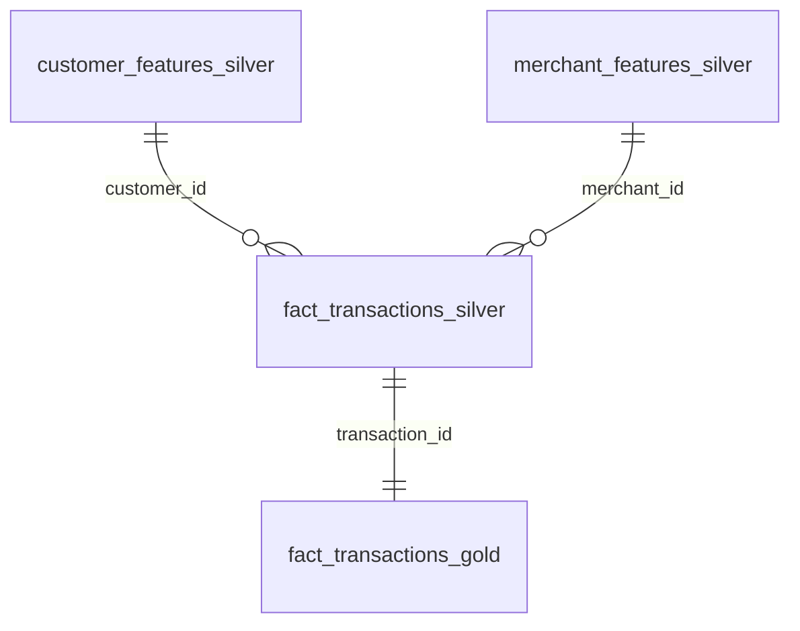

# Feature Engineering Pipeline

## Overview

The ETL pipeline (`etl.rs`, `src/etl/`) transforms Bronze Parquet into ML-ready Gold snapshots. It reads from `data/output/`, computes features in Rust/Polars, and writes timestamped Silver/Gold snapshots to `data/silver/` and `data/gold/<timestamp>/`. Downstream Python scripts query Gold via DuckDB.

The batch path is Parquet-only — ClickHouse is reserved for streaming `fraud_scores`. The previous ClickHouse-based architecture is documented in [ClickHouse Batch ETL (Defunct)](defunct/clickhouse_batch_etl.md).

## Schema

<div style="max-width: 600px; margin: 0 auto;">


</div>

**<a id="fig-5"></a>Figure 5:** Feature Engineering ETL Schema

| Dataset | Stage | Purpose |
| :--- | :--- | :--- |
| `customer_features_silver` | Silver | Per-customer aggregates (fraud rate, night/weekend ratios, mean amount) |
| `merchant_features_silver` | Silver | Per-merchant aggregates (fraud rate, total amount, mean amount) |
| `fact_transactions_silver` | Silver | Transaction-level sequence & behavioral features (velocity, z-scores, flags) |
| `fact_transactions_gold` | Gold | Silver + joined customer/merchant aggregates; snapshot for training |

<details>
<summary>Full field listings</summary>

### `customer_features_silver`

| Field | Type |
| :--- | :--- |
| `customer_id` | `String` |
| `name`, `email` | `String` |
| `account_count` | `UInt32` |
| `total_transactions` | `UInt32` |
| `total_fraud_transactions` | `UInt32` |
| `fraud_rate` | `Float64` |
| `avg_transaction_amount` | `Float64` |
| `night_transaction_ratio` | `Float64` |
| `weekend_transaction_ratio` | `Float64` |
| `first_transaction_ts`, `last_transaction_ts` | `Nullable(DateTime64(3, 'UTC'))` |

### `merchant_features_silver`

| Field | Type |
| :--- | :--- |
| `merchant_id`, `merchant_name`, `merchant_category` | `String` |
| `total_transactions` | `UInt32` |
| `total_amount`, `avg_transaction_amount` | `Float64` |
| `total_fraud_transactions` | `UInt32` |
| `merchant_fraud_rate` | `Float64` |

### `fact_transactions_silver`

| Category | Fields |
| :--- | :--- |
| Identity | `transaction_id`, `card_id`, `account_id`, `customer_id`, `merchant_id`, `merchant_category` |
| Transaction | `amount` (`Float64`), `timestamp` (`DateTime64(3, 'UTC')`), `transaction_channel`, `card_present`, `user_agent`, `ip_address` |
| Temporal | `time_since_last_transaction` (`Float64`), `transaction_sequence_number` (`UInt32`), `hours_since_midnight` (`Float64`), `is_weekend` (`UInt32`) |
| Behavioral | `spatial_velocity` (`Float64`, capped at 10,000 km/h), `hour_deviation_from_norm` (`Float64`), `amount_round_number_flag` (`UInt32`), `amount_deviation_z_score` (`Float64`), `rapid_fire_transaction_flag` (`UInt32`), `escalating_amounts_flag` (`UInt32`), `merchant_category_switch_flag` (`UInt32`) |
| Labels | `is_fraud` (`UInt32`), `fraud_target` (`UInt32`), `fraud_type` (`String`), `geo_anomaly`, `device_anomaly`, `ip_anomaly` (all `UInt32`), `campaign_id` (`Nullable(String)`) |

### `fact_transactions_gold`

Inherits all `fact_transactions_silver` columns plus:

| Field | Type | Source |
| :--- | :--- | :--- |
| `cf_fraud_rate` | `Float64` | `customer_features_silver` |
| `cf_night_tx_ratio` | `Float64` | `customer_features_silver` |
| `mf_fraud_rate` | `Float64` | `merchant_features_silver` |
| `campaign_txn_count` | `UInt32` | Hardcoded `0` (disabled) |
| `campaign_total_amount` | `Float64` | Hardcoded `0.0` (disabled) |
| `campaign_merchant_diversity` | `UInt32` | Hardcoded `0` (disabled) |
| `feature_calculated_at` | `DateTime` | Server timestamp |

</details>

## Architecture

### Parquet-Only Pipeline
No external database in the batch path. Generation writes `data/output/` → ETL reads Bronze, computes in Rust/Polars → writes `data/silver/` and `data/gold/<timestamp>/`. DuckDB queries Gold snapshots directly for training.

### Parallel Execution
`silver-all` runs `SilverCustomer`, `SilverMerchant`, and `SilverSequence` concurrently via `rayon`. Campaign is excluded (signal reliability issues) and must be invoked separately with a runtime warning.

### Sort-Before-Shift Ordering
Window functions (`shift(1).over()`) depend on per-customer timestamp ordering. A `.join()` after `.sort()` bug corrupted 70% of customers' sequence features across all prior snapshots. The fix: `.sort()` after `.join()` so `shift` always picks the chronologically previous transaction.

### Staged Gold Construction
Polars joins `fact_transactions_silver` against `customer_features_silver` and `merchant_features_silver`, then writes a timestamped snapshot. Gold is never overwritten — each run produces a new immutable snapshot directory.

## Invocation

```bash
cargo run --release --bin etl -- bronze        # copy data/output/ → data/bronze/<ts>/
cargo run --release --bin etl -- silver-all    # parallel Silver → data/silver/
cargo run --release --bin etl -- gold-master   # join Silver → data/gold/<ts>/
```

```python
import duckdb
conn = duckdb.connect()
df = conn.sql("SELECT * FROM 'data/gold/20260716_145639/fact_transactions_gold.parquet'").pl()
```

## Current Limitations

Campaign Silver is excluded from `silver-all` (no sort before `cum_sum`, isolated single-tx "campaigns"). Gold campaign columns are hardcoded to zero. Fix requires re-enabling `target_campaign_share` in `fraud_rules.yaml`, sorting, and filtering single-transaction clusters.

Entity-level features (`cf_fraud_rate`, `cf_night_tx_ratio`, `mf_fraud_rate`) leak the target — they're computed across the full batch including the row being predicted. Excluded from training in `train_xgboost.py`. Fix: compute on a held-out preceding time window.
