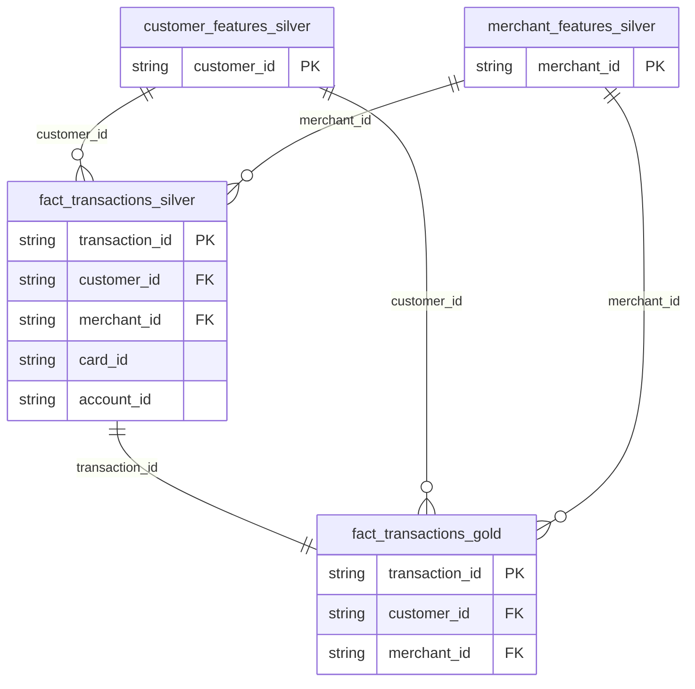

# Feature Engineering Pipeline

## Overview

The feature engineering pipeline (`etl.rs` and `src/etl/`) is the transformation engine that converts raw Bronze-level data into ML-ready features. It reads Parquet files from `data/output/` (Bronze stage), applies subject-specific feature engineering in Rust using `polars` lazy evaluation, and writes Silver and Gold Parquet snapshots to `data/silver/` and `data/gold/<timestamp>/`. The pipeline is invoked as a standalone binary (`riskfabric-etl`) with individual subcommands per stage, and is consumed downstream by Python ML scripts using DuckDB to query Gold Parquet snapshots.

**Architecture:** The batch ETL path is Parquet-only with no external database dependency. ClickHouse is reserved exclusively for the live streaming `fraud_scores` path. The previous ClickHouse-based batch architecture is documented in [ClickHouse Batch ETL (Defunct)](defunct/clickhouse_batch_etl.md).

## Schema

The four output datasets and their join relationships:



<details>
<summary><code>customer_features_silver</code></summary>

| Field Name | Type | Description |
| :--- | :--- | :--- |
| `customer_id` | `String` | UUID v4 link to the parent customer profile. |
| `name` | `String` | Customer name, carried over from `dim_customers`. |
| `email` | `String` | Customer email, carried over from `dim_customers`. |
| `account_count` | `UInt32` | Total number of accounts owned by the customer, aggregated from `dim_accounts`. |
| `total_transactions` | `UInt32` | Total count of transactions attributed to the customer. |
| `total_fraud_transactions` | `UInt32` | Count of transactions where `is_fraud = 1`. |
| `fraud_rate` | `Float64` | Ratio of fraudulent to total transactions (`total_fraud_transactions / total_transactions`). |
| `avg_transaction_amount` | `Float64` | Mean transaction amount across all customer transactions. |
| `night_transaction_ratio` | `Float64` | Proportion of transactions occurring between 22:00 and 06:00 UTC. |
| `weekend_transaction_ratio` | `Float64` | Proportion of transactions occurring on Saturday or Sunday. |
| `first_transaction_ts` | `Nullable(DateTime64(3, 'UTC'))` | Timestamp of the customer's earliest recorded transaction. |
| `last_transaction_ts` | `Nullable(DateTime64(3, 'UTC'))` | Timestamp of the customer's most recent recorded transaction. |

</details>

<details>
<summary><code>merchant_features_silver</code></summary>

| Field Name | Type | Description |
| :--- | :--- | :--- |
| `merchant_id` | `String` | Unique identifier of the merchant. |
| `merchant_name` | `String` | Name of the merchant, carried over from the Bronze transactions. |
| `merchant_category` | `String` | Category classification of the merchant. |
| `total_transactions` | `UInt32` | Total count of transactions processed by the merchant. |
| `total_amount` | `Float64` | Sum of all transaction amounts at this merchant. |
| `avg_transaction_amount` | `Float64` | Mean transaction amount at this merchant. |
| `total_fraud_transactions` | `UInt32` | Count of fraudulent transactions processed by the merchant. |
| `merchant_fraud_rate` | `Float64` | Ratio of fraudulent to total transactions (`total_fraud_transactions / total_transactions`). |

</details>

<details>
<summary><code>fact_transactions_silver</code></summary>

**Identity & context**

| Field Name | Type | Description |
| :--- | :--- | :--- |
| `transaction_id` | `String` | UUID v4 identifying the transaction. |
| `card_id` | `String` | UUID v4 link to the associated card entity. |
| `account_id` | `String` | UUID v4 link to the associated account entity. |
| `customer_id` | `String` | UUID v4 link to the associated customer profile. |
| `merchant_id` | `String` | Unique identifier of the merchant. |
| `merchant_category` | `String` | Category classification of the merchant. |
| `amount` | `Float64` | Transaction monetary value. |
| `timestamp` | `DateTime64(3, 'UTC')` | UTC timestamp of the transaction in millisecond precision. |
| `transaction_channel` | `String` | Channel used for the transaction (e.g., `"POS"`, `"Online"`, `"ATM"`). |
| `card_present` | `UInt32` | Flag (0 or 1) indicating if the physical card was present. |
| `user_agent` | `String` | User Agent string recorded for the transaction. |
| `ip_address` | `String` | IP address of the client device. |
| `is_fraud` | `UInt32` | Ground truth fraud label (0 or 1). |

**Sequence & temporal features**

| Field Name | Type | Description |
| :--- | :--- | :--- |
| `time_since_last_transaction` | `Float64` | Elapsed time in seconds since the customer's previous transaction; null for the first transaction. |
| `transaction_sequence_number` | `UInt32` | Cumulative count of transactions for this customer, ordered by timestamp. |
| `hours_since_midnight` | `Float64` | Fractional hour of the transaction within the day (e.g., 13.5 = 13:30). |
| `is_weekend` | `UInt32` | Flag (0 or 1) indicating if the transaction occurred on Saturday or Sunday. |

**Behavioral features**

| Field Name | Type | Description |
| :--- | :--- | :--- |
| `spatial_velocity` | `Float64` | Estimated travel speed in km/h between the current and previous transaction location; capped at 10,000 km/h to suppress infinite values. |
| `hour_deviation_from_norm` | `Float64` | Absolute deviation of the transaction hour from the customer's mean transaction hour. |
| `amount_round_number_flag` | `UInt32` | Flag (0 or 1) set when the amount is divisible by 1, 5, or 10 — a known carding heuristic. |
| `amount_deviation_z_score` | `Float64` | Z-score of the transaction amount relative to the customer's historical mean and standard deviation; 0 when undefined. |
| `rapid_fire_transaction_flag` | `UInt32` | Flag (0 or 1) set when `time_since_last_transaction` is 300 seconds (5 minutes) or less. |
| `escalating_amounts_flag` | `UInt32` | Flag (0 or 1) set when the previous two transactions show a strictly increasing amount pattern. |
| `merchant_category_switch_flag` | `UInt32` | Flag (0 or 1) set when the merchant category differs from the immediately preceding transaction. |

**Anomaly & fraud labels**

| Field Name | Type | Description |
| :--- | :--- | :--- |
| `fraud_target` | `UInt32` | Ground truth fraud target label from fraud metadata. |
| `fraud_type` | `String` | Type classification of injected fraud (e.g., `"velocity_abuse"`, `"account_takeover"`); `"none"` for legitimate transactions. |
| `geo_anomaly` | `UInt32` | Flag (0 or 1) from fraud metadata indicating a geographic anomaly was injected. |
| `device_anomaly` | `UInt32` | Flag (0 or 1) from fraud metadata indicating a device anomaly was injected. |
| `ip_anomaly` | `UInt32` | Flag (0 or 1) from fraud metadata indicating an IP anomaly was injected. |
| `campaign_id` | `Nullable(String)` | UUID of the fraudulent campaign the transaction belongs to; null for non-campaign transactions. |

</details>

<details>
<summary><code>fact_transactions_gold</code></summary>

Inherits all columns from `fact_transactions_silver`, plus the following joined and derived fields:

| Field Name | Type | Description |
| :--- | :--- | :--- |
| `cf_fraud_rate` | `Float64` | Customer-level fraud rate, joined from `customer_features_silver`. |
| `cf_night_tx_ratio` | `Float64` | Customer-level night transaction ratio, joined from `customer_features_silver`. |
| `mf_fraud_rate` | `Float64` | Merchant-level fraud rate, joined from `merchant_features_silver`. |
| `campaign_txn_count` | `UInt32` | Transaction count within the fraud campaign; currently hardcoded to `0` (Campaign stage disabled). |
| `campaign_total_amount` | `Float64` | Total amount transacted in the fraud campaign; currently hardcoded to `0.0` (Campaign stage disabled). |
| `campaign_merchant_diversity` | `UInt32` | Unique merchant count within the campaign; currently hardcoded to `0` (Campaign stage disabled). |
| `feature_calculated_at` | `DateTime` | Server timestamp recorded at Gold table creation time, used for feature lineage tracking. |

</details>

## Architecture

**Parquet-Only Pipeline:** Data flows entirely through Parquet files with no external database dependency in the batch path. Generation writes to `data/output/`. The ETL reads from `data/output/` (Bronze), transforms in Rust/Polars, and writes Parquet snapshots to `data/silver/` and `data/gold/<timestamp>/`. DuckDB (embedded, no server) queries Gold snapshots for ML training via `conn.sql("SELECT * FROM 'data/gold/<snapshot>/fact_transactions_gold.parquet'").pl()`.

**Parallel Execution** is used for the stable Silver stages. When the `silver-all` subcommand is invoked, `rayon` parallelizes `SilverCustomer`, `SilverMerchant`, and `SilverSequence` as concurrent threads. The Campaign stage is explicitly excluded from `silver-all` due to unresolved signal reliability issues and must be run individually via its own subcommand, which emits a warning at runtime. The Device/IP and Network reputation stages have been removed from the pipeline entirely — see `decisions/ip_device_reputation_removal.md`.

**Feature Engineering in Rust:** Feature transformation logic — including per-customer windowed aggregations, z-score normalization, spatial velocity derivation, and the round-number flag heuristic — is implemented in Rust using `polars` lazy evaluation. Active features are documented in the [Feature Leakage Case Study](../feature_leakage_issues.md) alongside the iterative discovery process that shaped them.

**Sort-Before-Shift Ordering:** All window functions (`.shift().over()`, cumulative operations) depend on proper per-customer timestamp ordering. The `join()` after `sort()` bug documented in the [Feature Leakage Case Study](../feature_leakage_issues.md) caused 70% of customers to have corrupted sequence features across all prior snapshots. The fix moved the `.sort()` after the `.join()` so that `shift(1).over([col("customer_id")])` always picks the chronologically previous transaction.

**Staged Gold Construction** assembles the Gold table via Polars joins against `customer_features_silver` and `merchant_features_silver` Parquet files, then writes a timestamped snapshot to `data/gold/`. Each run produces a new snapshot directory — Gold is never overwritten in-place, preserving immutable versioned releases of each training dataset.

## Invocation

```
cargo run --release --bin etl -- bronze        # copy data/output/ → data/bronze/<ts>/
cargo run --release --bin etl -- silver-all    # parallel Silver stages → data/silver/
cargo run --release --bin etl -- gold-master   # join Silver → data/gold/<ts>/
```

Python downstream consumes Gold directly:

```python
import duckdb
conn = duckdb.connect()
df = conn.sql("SELECT * FROM 'data/gold/20260716_145639/fact_transactions_gold.parquet'").pl()
```

## Known Issues

The Campaign Silver stage is excluded from the `silver-all` parallel execution path due to unresolved signal reliability issues. It runs without errors but produces features whose statistical properties have not been validated against the ground truth labels. As a result, the corresponding Gold table columns (`campaign_txn_count`, `campaign_total_amount`, `campaign_merchant_diversity`) are hardcoded to zero in the current Gold build, making them useless as ML features.

The Device/IP and Network reputation stages have been removed from the codebase (see `decisions/ip_device_reputation_removal.md`); the `ip_fraud_rate`, `ip_degree`, `dev_fraud_rate`, `dev_degree`, and `suspicious_cluster_member` Gold columns no longer exist, and their `network.rs` / `device_ip.rs` transforms, `SilverNetwork` / `SilverDeviceIp` subcommands, and `ip_features_silver` / `device_features_silver` tables were deleted.

Entity-level features (`cf_fraud_rate`, `cf_night_tx_ratio`, `mf_fraud_rate`) are computed across the full batch including the transactions being predicted, creating a target encoding leak. These features must be excluded from ML training unless computed on a held-out time window. They are present in the Gold schema for analytical purposes but removed from the training feature set in `train_xgboost.py`.

Training is always deterministic for a given seed: the Rust generator uses a cascaded seed through per-index deterministic `StdRng` instances, and all Python scripts use explicit `np.random.default_rng(seed)` objects. Parquet snapshots are immutable and versioned by timestamp, making every training run fully reproducible.
