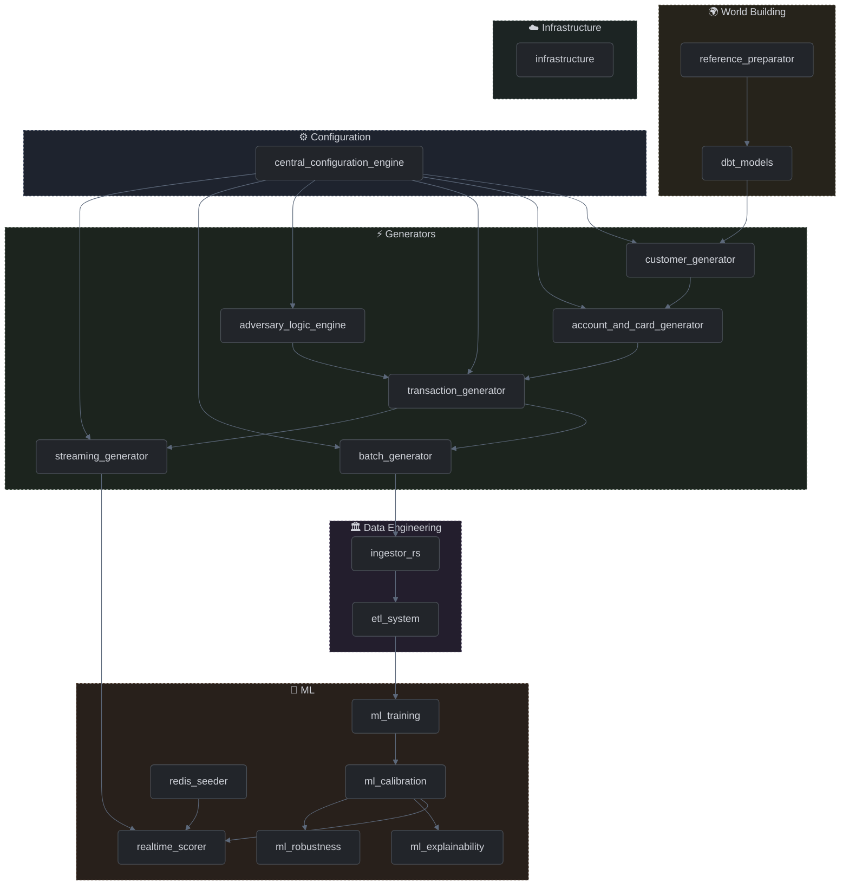

# Codebase Components

This section provides a detailed technical breakdown of the individual modules, engines, and utilities that make up the RiskFabric simulation environment. Each document explains the architectural intent and system integration of a specific file or directory.

## Component Dependency Map

