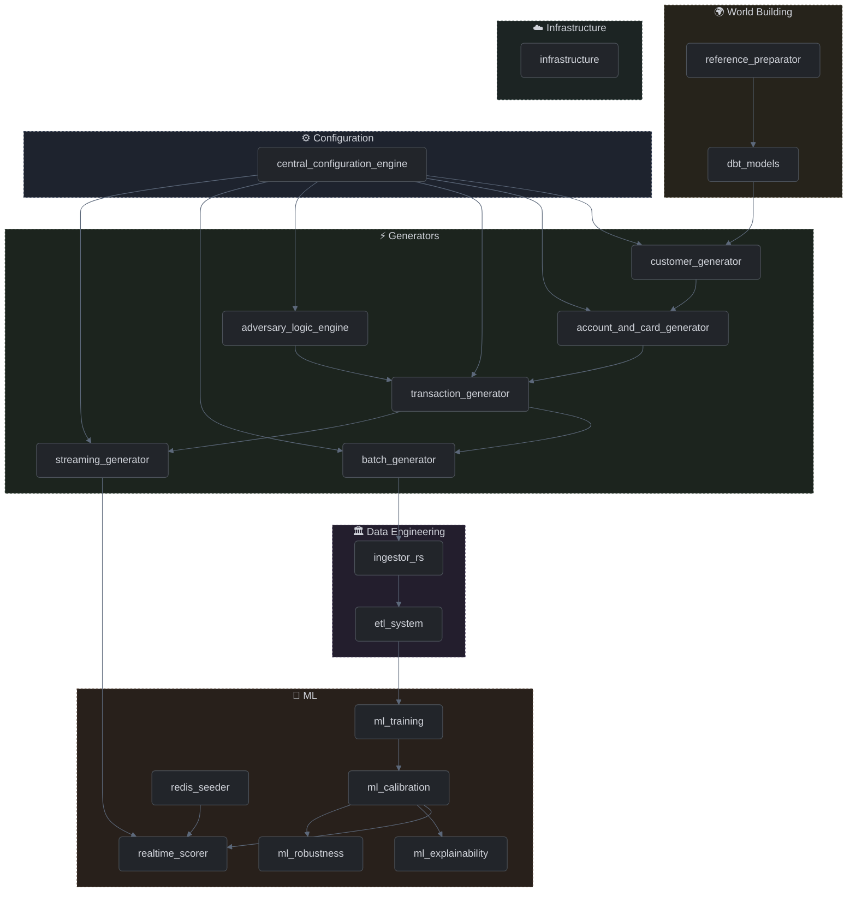

# Codebase Components

This section provides a detailed technical breakdown of the individual modules, engines, and utilities that make up the RiskFabric simulation environment. Each document explains the architectural intent and system integration of a specific file or directory.

## Component Dependency Map

**Figure 17:** Component Dependency Map

## Modules

- [Customer Data Generator](customer_generator.md)
- [Account and Card Data Generator](account_and_card_generator.md)
- [Transactional Data Generator](transaction_generator.md)
- [Batch Orchestrator](batch_generator.md)
- [Streaming Orchestrator](streaming_generator.md)
- [Fraud Injector](adversary_logic_engine.md)
- [Configuration Module](configuration.md)
- [Feature Engineering Pipeline](etl_system.md)
- [Geospatial Reference Pipeline](dbt_models.md)
- [OSM Reference Extractor](reference_preparator.md)
- [Ingestor Service](ingestor_rs.md)
- [Training Pipeline](ml_training.md)
- [Model Calibration](ml_calibration.md)
- [Real-Time Scoring Service](realtime_scorer.md)
- [Model Explainability (SHAP)](ml_explainability.md)
- [Model Robustness & Drift](ml_robustness.md)
- [Infrastructure & Local Stack](infrastructure.md)
- [Django Case Management UI](case_admin.md)
- [Redis Feature Seeder](redis_seeder.md)

