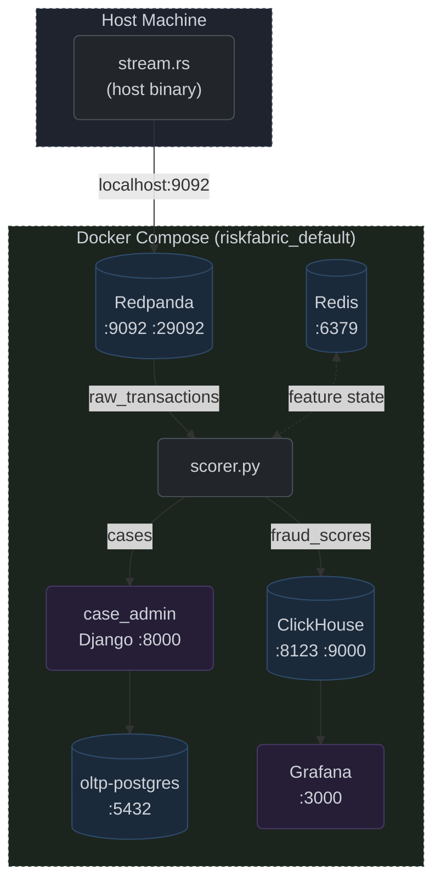

# Infrastructure & Local Service Stack

## Overview

The local service stack (`docker-compose.yml`) provisions 7 services on `riskfabric_default`: ClickHouse, Redpanda, Redis, OLTP Postgres, scorer (`scorer.py`), Grafana, and Django case-admin. Mandatory runtime dependency for all Rust binaries and Python ML services. A separate Postgres instance (not in this compose file) handles world-building for `prepare_refs.rs` and `export_references.rs`.

## Schema

**Figure 8:** Infrastructure Service Stack

| Service | Image | Ports | Persistence |
| :--- | :--- | :--- | :--- |
| `clickhouse` | `clickhouse/clickhouse-server:latest` | `8123`, `9000` | `clickhouse_data`, `clickhouse_logs` |
| `redpanda` | `redpandadata/redpanda:v23.2.1` | `9092` (ext), `29092` (int) | None (ephemeral) |
| `redis` | `redis:7-alpine` | `6379` | None (ephemeral) |
| `scorer` | `localhost/riskfabric_dlt` | — | Workspace mount `/usr/app` |
| `grafana` | `grafana/grafana-oss:latest` | `3000` | `grafana_data` |
| `oltp-postgres` | `postgres:15-alpine` | `5433`→host | `oltp_postgres_data` |
| `case-admin` | built from `case_admin/Dockerfile` | `8001`→host | `case_admin/` mount |

## Architecture

### Multi-Model Database Strategy
ClickHouse for append-heavy analytical queries (fraud scores), Redpanda for Kafka-compatible streaming, Redis for sub-millisecond per-card/customer state (verified: p50 120–261 µs, p99 ≤509 µs across all operations) [[See benchmarks](performance.md)], Postgres for OLTP case management.

### Health-Check Gating
All data services health-checked (ClickHouse via `wget`, Redpanda via `rpk`, Redis via `redis-cli`, Postgres via `pg_isready`). `scorer`, `grafana`, and `case-admin` wait for `service_healthy` before startup. 5s interval, 5 retries.

### Dual Kafka Listener
Redpanda exposes port `29092` for container-to-container traffic and `9092` for host access (`stream.rs`). `scorer` connects via `KAFKA_BOOTSTRAP_SERVERS=redpanda:29092`.

### Workspace Volume Mounts
`scorer` mounts entire project at `/usr/app`, `case-admin` mounts `case_admin/` at `/usr/app`. Source changes take effect on container restart without image rebuild. The scorer image must be built from `Dockerfile.dlt` before first run.

## Current Limitations

Redpanda is ephemeral — all topic data lost on restart, preventing replay testing. Passwords hardcoded in `docker-compose.yml` and repeated across Python scripts with no `.env` support. No `build:` directive for the scorer image.
