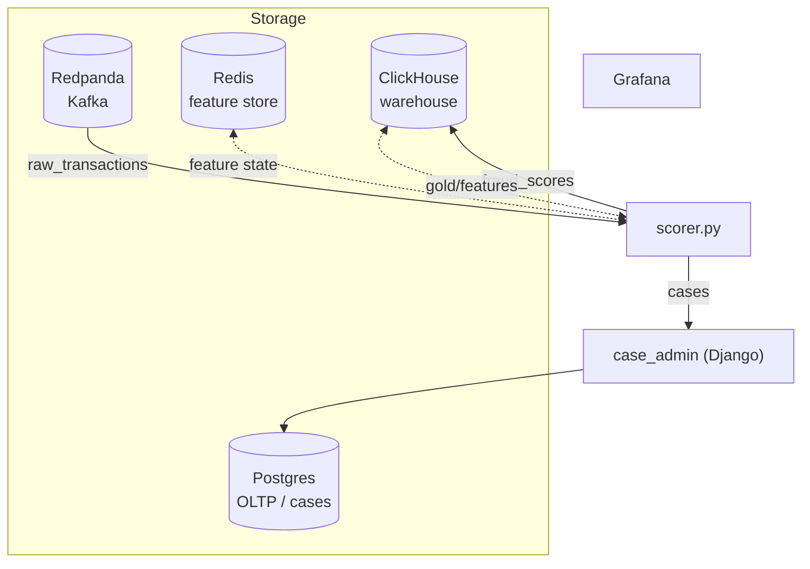

# Infrastructure & Local Service Stack

## Overview

The local service stack (`docker-compose.yml`) defines the environment that RiskFabric runs against. It provisions ClickHouse for warehouse storage, Redpanda (a Kafka-compatible event broker) for the streaming pipeline, Redis for the real-time feature store, an OLTP Postgres for the case-management database, a long-lived scorer container running `scorer.py`, a Grafana dashboard container, and a Django case-management container running `case_admin`. All containers are connected on a shared network named `riskfabric_default`. The stack is the mandatory runtime dependency for all Rust binaries and Python ML services.

## Schema

The stack provisions seven services on a shared `riskfabric_default` network:

Service Inventory

| Service | Container Name | Image | Exposed Ports | Persistence |
| :--- | :--- | :--- | :--- | :--- |
| `clickhouse` | `riskfabric_clickhouse` | `clickhouse/clickhouse-server:latest` | `8123` (HTTP), `9000` (native) | Named volumes: `clickhouse_data`, `clickhouse_logs` |
| `redpanda` | `riskfabric_redpanda` | `docker.redpanda.com/redpandadata/redpanda:v23.2.1` | `9092` (external Kafka), `29092` (internal Kafka) | No volume — ephemeral |
| `redis` | `riskfabric_redis` | `redis:7-alpine` | `6379` | No volume — ephemeral |
| `scorer` | `riskfabric_scorer` | `localhost/riskfabric_dlt` | None | Mounts workspace at `/usr/app` |
| `grafana` | `riskfabric_grafana` | `grafana/grafana-oss:latest` | `3000` (Grafana) | Named volume: `grafana_data` |
| `oltp-postgres` | `riskfabric_oltp_postgres` | `postgres:15-alpine` | `5433` (host) → `5432` | Named volume: `oltp_postgres_data` |
| `case-admin` | `riskfabric_case_admin` | built from `case_admin/Dockerfile` | `8001` (host) → `8000` | Mounts `case_admin/` at `/usr/app` |

Redpanda Configuration

| Parameter | Value | Description |
| :--- | :--- | :--- |
| `--smp` | `1` | Single CPU core allocated. |
| `--memory` | `512M` | Maximum memory cap. |
| `--reserve-memory` | `0M` | No memory reserved for the OS. |
| `--overprovisioned` | _(flag)_ | Disables CPU pinning checks for non-dedicated hardware. |
| `--node-id` | `0` | Single-node cluster identifier. |
| `--check` | `false` | Disables startup checks for non-dedicated hardware. |
| `--kafka-addr` | `PLAINTEXT://0.0.0.0:29092,OUTSIDE://0.0.0.0:9092` | Dual listener: internal (`29092`) for container-to-container traffic, external (`9092`) for host access. |
| `--advertise-kafka-addr` | `PLAINTEXT://redpanda:29092,OUTSIDE://localhost:9092` | Advertised listeners for internal vs. host access. |

**Multi-Model Database Strategy** is the primary architectural decision. ClickHouse is used for columnar storage of high-volume transaction, feature, and score tables — its MergeTree engine is optimized for append-heavy analytical workloads. Redpanda provides Kafka-compatible event streaming for the real-time transaction path without requiring a full Kafka + ZooKeeper deployment. Redis provides O(1) per-key lookups for per-card and per-customer behavioral state that cannot be satisfied by ClickHouse at sub-millisecond latency. Postgres (`oltp-postgres`) holds the OLTP case-management database used by `case_admin` and is part of this stack — note this is distinct from the separate Postgres instance used in the world-building phase by `prepare_refs.rs` and `export_references.rs`, which is run separately before those binaries.

**Health-Check Gating** is applied to all three data services (ClickHouse, Redpanda, Redis) and the `oltp-postgres` service, and enforced as a startup dependency for the `scorer`, `grafana`, and `case-admin` containers. ClickHouse is checked via `wget --spider localhost:8123/ping`, Redpanda via `rpk cluster health`, Redis via `redis-cli ping`, and Postgres via `pg_isready`. All use a 5-second interval with 5 retries. The `scorer` container's `depends_on` block requires ClickHouse, Redpanda, Redis, and `oltp-postgres` to report `service_healthy` before `scorer.py` starts, preventing connection-refused failures during cold-start.

**Dual Kafka Listener** is configured on Redpanda to support both container-internal and host-external access on separate ports. The `PLAINTEXT` listener on port `29092` is advertised as `redpanda:29092` for container-to-container traffic (e.g., `scorer.py` connecting from within the `riskfabric_default` network). The `OUTSIDE` listener on port `9092` is advertised at `localhost:9092` for host-level tooling (e.g., `rpk` CLI or `stream.rs` running on the host). The `scorer` service is wired to the internal listener via `KAFKA_BOOTSTRAP_SERVERS=redpanda:29092`.

**Workspace Volume Mount** is used for the `scorer` and `case-admin` containers instead of baking the Python source into the image. The `scorer` container mounts the entire project directory at `/usr/app` with the `z` SELinux label; `case-admin` mounts `case_admin/` at `/usr/app`. This means changes to `scorer.py`, `case_admin/`, or any model JSON in `models/` take effect on the next container restart without rebuilding the image — important during iterative development. The `scorer` image (`localhost/riskfabric_dlt`) must be built locally from `Dockerfile.dlt` before the stack can start.

`docker-compose.yml` is the foundational layer that all other components depend on. It must be started before any Rust binary or Python script that connects to ClickHouse, Redpanda, Redis, or the OLTP Postgres. The separate Postgres instance used by `prepare_refs.rs` and `export_references.rs` for world-building is not managed by this file and must be run separately.

## Known Issues

Redpanda is configured with no persistent volume, meaning all Kafka topic data — including the `raw_transactions` topic — is lost on every container restart. This prevents replay testing and means that if the `scorer` container crashes mid-stream, all in-flight transactions are unrecoverable. Adding a named volume for Redpanda's data directory would make the streaming state persistent across restarts without requiring a multi-node configuration.

The ClickHouse password (`123`) is hardcoded directly in `docker-compose.yml` as an environment variable, and the same credential is repeated as a plaintext string in `ingest.rs`, `etl.rs`, `train_xgboost.py`, `scorer.py`, and `seed_redis.py`. The OLTP Postgres password (`123`) is similarly hardcoded in `docker-compose.yml` and `ingest_cases.py`. There is no `.env` file and no secret management. Moving all credentials to a `.env` file and referencing them via `${VAR}` substitution in both the Compose file and Python scripts is required before the stack can be safely committed to a shared or public repository.

The `scorer` container references `localhost/riskfabric_dlt` as its image, which must be built locally from `Dockerfile.dlt` before the stack can start. There is no `build:` directive in the Compose file to trigger this automatically. A developer encountering a `image not found` error has no in-file indication of how to build the prerequisite image, as there is no `Makefile` or `README` section that documents the build step adjacent to the compose file.
