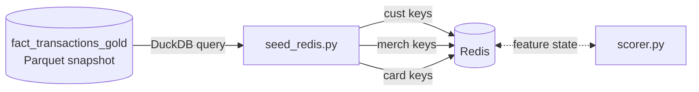

# Redis Feature Seeder

## Overview

The Redis seeder (`seed_redis.py`) is an operational utility that initializes the real-time feature store with pre-computed historical state derived from the Gold Parquet snapshot (`fact_transactions_gold`). It reads the most recent snapshot from `data/gold/*/fact_transactions_gold.parquet` (via DuckDB) and writes the results into the Redis key schema expected by `scorer.py`. It must be run after the Gold table has been materialized by `etl.rs` (which produces the Parquet snapshot) and before `stream.rs` and `scorer.py` are started.

## Schema

The seeder reads the Gold Parquet snapshot through DuckDB and writes the terminal state into the Redis key schema consumed by `scorer.py`:

Seeded Redis Keys

| Key Pattern | Redis Type | Fields Written | Source Query |
| :--- | :--- | :--- | :--- |
| `cust:{customer_id}:stats` | Hash | `count`, `mean`, `M2` | Per-customer `count()`, `avg(amount)`, `sum((amount - mean)²)` from `fact_transactions_gold`. |
| `cust:{customer_id}:agg` | Hash | `fraud_rate`, `night_ratio` | Per-customer `cf_fraud_rate`, `cf_night_tx_ratio` from `fact_transactions_gold`. |
| `merch:{merchant_id}:agg` | Hash | `fraud_rate` | Per-merchant `avg(is_fraud)` from `fact_transactions_gold`. |
| `card:{card_id}:history` | List | JSON objects: `transaction_id`, `merchant_category`, `amount`, `timestamp`, `location_lat`, `location_long` | Last 10 transactions per card ordered by `timestamp DESC`, via window function `row_number()`. |
| `card:{card_id}:last_ts` | String | Unix timestamp of most recent transaction | Written only for `rn = 1` (the latest transaction per card). |
| `card:{card_id}:loc` | Hash | `lat`, `lon` | Written only for `rn = 1` (the latest transaction per card). |
| `card:{card_id}:seq` | String | Approximate sequence counter, initialized to `1` | Written only for `rn = 1`; reflects `row_number` value, not true cumulative count. |

**Warm-Start Inference** is the core purpose of the seeder. Without pre-seeded state, the first transaction for every card and customer in the streaming pipeline would produce degenerate feature values: `time_since_last_transaction = 0`, `amount_deviation_z_score = 0` (no prior mean), `spatial_velocity = 0` (no prior location), and an empty card history. The seeder eliminates this cold-start period by loading the terminal state of the batch simulation into Redis before the streaming phase begins, allowing `scorer.py` to produce meaningful behavioral features from the first event.

**Welford State Seeding** initializes the per-customer running statistics from a single aggregation query rather than replaying every historical transaction. The query computes `count()`, `avg(amount)`, and `sum((amount - mean) * (amount - mean))` — the three Welford accumulator fields (`count`, `mean`, `M2`) — in one DuckDB pass over the Gold Parquet snapshot. This gives `scorer.py`'s `WelfordState` class an accurate starting point for computing `amount_deviation_z_score` incrementally on new streaming events, matching the statistical baseline established during batch training.

**Windowed Card History via Row Number** selects the last 10 transactions per card using a `row_number() OVER (PARTITION BY card_id ORDER BY timestamp DESC)` window function and filters to `rn <= 10`. The results are written as JSON strings to a Redis List at `card:{card_id}:history` via `RPUSH`. Location and timestamp state (`card:{card_id}:last_ts`, `card:{card_id}:loc`) are written only for the row where `rn = 1`, ensuring that the scorer's initial velocity and time-since calculations are anchored to the most recent known transaction per card.

**Fault-Tolerant Query Execution** wraps each of the five seeding queries in a `try/except` block that prints a warning and continues rather than aborting. This means the seeder will complete successfully even if `fact_transactions_gold` is partially populated or missing certain columns, leaving the corresponding Redis keys unseeded. The `scorer.py` handles missing Redis keys by defaulting to zero values for the affected features.

`seed_redis.py` is a one-shot synchronization utility that bridges the **Data layer** (Gold Parquet snapshot via DuckDB) and the **Scoring layer** (Redis). It has no upstream or downstream runtime dependency beyond requiring the Gold Parquet snapshot to exist and Redis to be available. It does not need to be re-run unless the Gold snapshot is rebuilt or Redis is flushed.

## Known Issues

The seeder loads all five query result sets entirely into local Python memory before writing to Redis. For a synthetic population of 1 million customers with 365 days of transactions, `fact_transactions_gold` may contain hundreds of millions of rows. The card history query in particular selects up to 10 rows per card and then iterates row-by-row to write to Redis — this pattern will cause memory-exhaustion failure at scale. Refactoring to stream results in chunks using `clickhouse_connect`'s cursor API and processing each chunk before fetching the next is required before the seeder can handle large populations.

The `card:{card_id}:seq` key is initialized to the `row_number()` value (`1`) for the most recent transaction, not the actual cumulative transaction count for the card. This means `scorer.py`'s `r.incr(f"card:{card_id}:seq")` will produce a sequence number of `2` for the first streaming transaction rather than the true historical count. The `transaction_sequence_number` feature fed to the model is therefore incorrect for all cards that have prior history. The fix requires the seeder to query the true total transaction count per card and use that as the initial sequence value.

The ClickHouse password (`123`) is hardcoded as a string literal in the `clickhouse_connect.get_client` call. This is the same credential duplicated across `ingest.rs`, `etl.rs`, `train_xgboost.py`, and `scorer.py`. Moving the credential to the `CLICKHOUSE_PASSWORD` environment variable — already defined in `docker-compose.yml` for the scorer container — and reading it via `os.getenv` would make this consistent with how the other services in the stack handle credentials.
an be safely committed to a shared or public repository.
