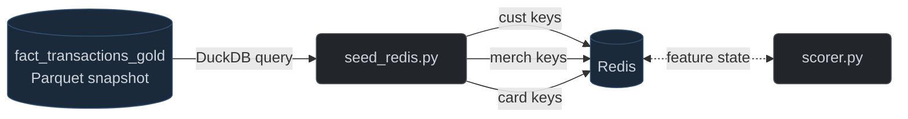

# Redis Feature Seeder

## Overview

`seed_redis.py` initializes Redis with pre-computed historical state from the Gold Parquet snapshot. Reads the latest `data/gold/*/fact_transactions_gold.parquet` via DuckDB and writes the Redis key schema expected by `scorer.py`. Run after `etl.rs` produces Gold, before `stream.rs` and `scorer.py` start.

## Schema

**Figure 11:** Redis Feature Seeder Flow

| Key Pattern | Redis Type | Fields | Source Query |
| :--- | :--- | :--- | :--- |
| `cust:{id}:stats` | Hash | `count`, `mean`, `M2` | Per-customer Welford accumulators from Gold |
| `cust:{id}:agg` | Hash | `fraud_rate`, `mean_hour` | `cf_fraud_rate`, `avg(hour(timestamp))` |
| `merch:{id}:agg` | Hash | `fraud_rate` | `avg(is_fraud)` per merchant |
| `card:{id}:history` | List (JSON, max 10) | Last 10 txns | `row_number() OVER (PARTITION BY card_id ORDER BY timestamp DESC) ≤ 10` |
| `card:{id}:last_ts` | String | Unix ts of latest txn | `rn = 1` only |
| `card:{id}:loc` | Hash | `lat`, `lon` | `rn = 1` only |
| `card:{id}:seq` | String | Initialized to `1` | `rn = 1` only |

## Architecture

### Warm-Start Inference
Without pre-seeded state, the first streaming transaction per card/customer produces degenerate features (zero velocity, no prior mean, empty history). The seeder loads batch simulation terminal state so `scorer.py` produces meaningful features from event one.

### Welford State Seeding
Computes `count`, `mean`, and `M2` (sum of squared deviations) in a single DuckDB pass over Gold Parquet. Gives `scorer.py`'s `WelfordState` an accurate starting point for incremental `amount_deviation_z_score`.

### Windowed Card History
`row_number() OVER (PARTITION BY card_id ORDER BY timestamp DESC)` selects the last 10 transactions per card. Results written as JSON strings to `card:{id}:history` via `RPUSH`. Location/ts state written only for `rn = 1`.

### Fault-Tolerant Execution
All six queries wrapped in `try/except` — prints warning and continues on failure. `scorer.py` handles missing keys by defaulting to zero.

## Current Limitations

All five query result sets are loaded entirely into Python memory before writing to Redis. For comparison, the generator peak RSS is 3.6 GB at 3,400 customers and 6.5 GB at 10,000 customers — the seeder loads all card history into memory in a single pass, so the OOM boundary scales similarly. For 1M customers with 365 days of history, the card history query will OOM. [[See benchmarks](performance.md)] Streaming in chunks from DuckDB is required.

`card:{id}:seq` is initialized to `1` (the `row_number()`) rather than true cumulative count. `scorer.py`'s `r.incr()` produces sequence number 2 for the first streaming transaction instead of historical count + 1.
