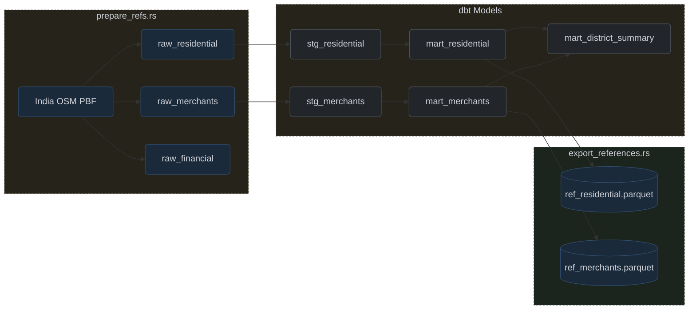

# OSM Reference Extractor

## Overview

`prepare_refs.rs` converts the India OSM PBF file into three Postgres staging tables (`raw_residential`, `raw_merchants`, `raw_financial`) consumed by `export_references.rs` → Parquet for `generate.rs`, `stream.rs`, and `customer_gen.rs`. Six subcommands: `extract-nodes`, `map-city-state`, `parse-districts`, `map-state-districts`, `normalize-states`, `compare-city-district`.

## Schema

**Figure 6:** OSM Reference Extraction Pipeline

Staging tables

| Table | Struct | Key fields | Classification rules |
| :--- | :--- | :--- | :--- |
| `raw_residential` | `ResidentialPoint` | `osm_id`, `h3_index` (res 8), `lat`, `lon`, `city`, `postcode`, `state` | `building=residential` / `landuse=residential`, or `addr:housenumber` / `addr:street` present |
| `raw_merchants` | `MerchantPoint` | `osm_id`, `h3_index` (res 8), `name`, `category`, `sub_category`, `lat`, `lon`, `city`, `postcode`, `state` | `shop=*` (all), `amenity` (restaurant/cafe/fast_food/bar/pub/fuel/cinema/pharmacy), `tourism` (hotel/motel/guest_house) |
| `raw_financial` | `FinancialPoint` | `osm_id`, `h3_index` (res 8), `kind` (atm/bank), `operator`, `lat`, `lon` | `amenity=atm` / `amenity=bank` |

All three tables share `osm_id` and `h3_index`. The detailed dbt pipeline is in [Geospatial Reference Pipeline](dbt_models.md).

## Architecture

### Parallel Map-Reduce Extraction
The `osmpbf` library's `par_map_reduce` distributes OSM node processing across CPU cores via `rayon`. Each thread produces `ResidentialPoint`, `MerchantPoint`, and `FinancialPoint` records merged on completion.

### Binary Copy Insertion
Records are written to Postgres via `BinaryCopyInWriter` in a single `COPY FROM STDIN BINARY` operation — bypasses SQL parsing and keeps insert time proportional to record count.

### H3 Indexing at Resolution 8
`h3o` converts each `(lat, lon)` to an H3 cell (~0.74 km²) at extraction time. The index flows through all downstream tables and Parquet files, enabling proximity-based merchant selection without runtime coordinate re-computation.

### State Normalization Utilities
`map-city-state` produces ranked city-to-state frequency reports. `parse-districts` extracts India admin level-5 relations. Intermediate report files feed normalization rules applied in dbt staging.

## Current Limitations

`extract-nodes` loads entire dataset into three `Arc<Mutex<Vec<_>>>` collections before writing — millions of records in RAM, OOM mid-extraction loses all state. Periodic chunked flushes would bound peak memory.

The workflow (prepare → dbt run → export) requires three separately-invoked binaries with no orchestration. A unified subcommand or pipeline runner is needed.
