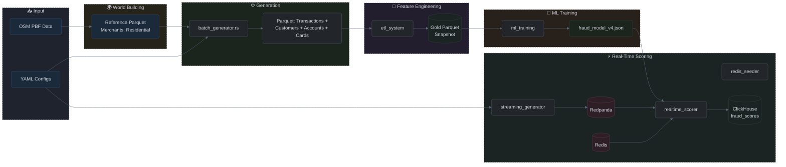

# Conceptual Explanations

High-level documentation explaining the underlying philosophy, architectural strategies, and simulation logic of RiskFabric.

## End-to-End Data Flow

```mermaid
%%{init: {
  'themeVariables': {
    'fontFamily': '"JetBrains Mono", monospace'
  }
}}%%
flowchart LR
    %% Node Class Definitions
    classDef defaultNode fill:#22252a,stroke:#4d535b,stroke-width:1px,rx:5px,ry:5px,color:#cfd2d9;
    classDef inputNode fill:#1b2a3a,stroke:#304e70,stroke-width:1px,rx:5px,ry:5px,color:#cfd2d9;
    classDef dbNode fill:#1c2423,stroke:#2e403d,stroke-width:1px,rx:5px,ry:5px,color:#cfd2d9;

    subgraph INPUT["📥 Input"]
        OSM["OSM PBF Data"]:::inputNode
        YAML["YAML Configs"]:::inputNode
    end

    subgraph WB["🌍 World Building"]
        OSM --> REF["Reference Parquet<br/>Merchants, Residential"]:::defaultNode
    end

    subgraph GEN["⚙️ Generation"]
        YAML --> GEN_RS["batch_generator.rs"]:::defaultNode
        REF --> GEN_RS
        GEN_RS --> TXN_PQ["Parquet: Transactions +<br/>Customers + Accounts + Cards"]:::defaultNode
    end

    subgraph FE["🔧 Feature Engineering"]
        TXN_PQ --> ETL_RS["etl_system"]:::defaultNode
        ETL_RS --> GOLD[("Gold Parquet\nSnapshot")]:::dbNode
    end

    subgraph ML_TRAIN["🧠 ML Training"]
        GOLD --> TRAIN_PY["ml_training"]:::defaultNode
        TRAIN_PY --> MODEL["fraud_model_v4.json"]:::defaultNode
    end

    subgraph RT["⚡ Real-Time Scoring"]
        YAML --> STREAM_RS["streaming_generator"]:::defaultNode
        STREAM_RS --> KAFKA[("Redpanda")]:::dbNode
        KAFKA --> SCORER_PY["realtime_scorer"]:::defaultNode
        MODEL --> SCORER_PY
        SEED_PY["redis_seeder"]:::defaultNode
        REDIS[("Redis")]:::dbNode
        REDIS --> SCORER_PY
        SCORER_PY --> SCORES[("ClickHouse\nfraud_scores")]:::dbNode
    end

    %% Subgraph Styling
    style INPUT fill:#1e232e,stroke:#333e54,stroke-width:1px,stroke-dasharray: 3 3,color:#cfd2d9;
    style WB fill:#26231b,stroke:#474130,stroke-width:1px,stroke-dasharray: 3 3,color:#cfd2d9;
    style GEN fill:#1c241e,stroke:#304033,stroke-width:1px,stroke-dasharray: 3 3,color:#cfd2d9;
    style FE fill:#231e2d,stroke:#3f3354,stroke-width:1px,stroke-dasharray: 3 3,color:#cfd2d9;
    style ML_TRAIN fill:#28201b,stroke:#4c392c,stroke-width:1px,stroke-dasharray: 3 3,color:#cfd2d9;
    style RT fill:#1c2423,stroke:#2e403d,stroke-width:1px,stroke-dasharray: 3 3,color:#cfd2d9;

    %% Node Specific Styling Override to match theme
    style REF fill:#1b2a3a,stroke:#304e70,stroke-width:1px,color:#cfd2d9;
    style GOLD fill:#1c2423,stroke:#2e403d,stroke-width:1px,color:#cfd2d9;
    style MODEL fill:#1c241e,stroke:#304033,stroke-width:1px,color:#cfd2d9;
    style REDIS fill:#2e1f26,stroke:#573a46,stroke-width:1px,color:#cfd2d9;
    style KAFKA fill:#2e1f26,stroke:#573a46,stroke-width:1px,color:#cfd2d9;
    style SCORES fill:#1c2423,stroke:#2e403d,stroke-width:1px,color:#cfd2d9;

    linkStyle default stroke-width:1px,stroke:#5c687a
```
