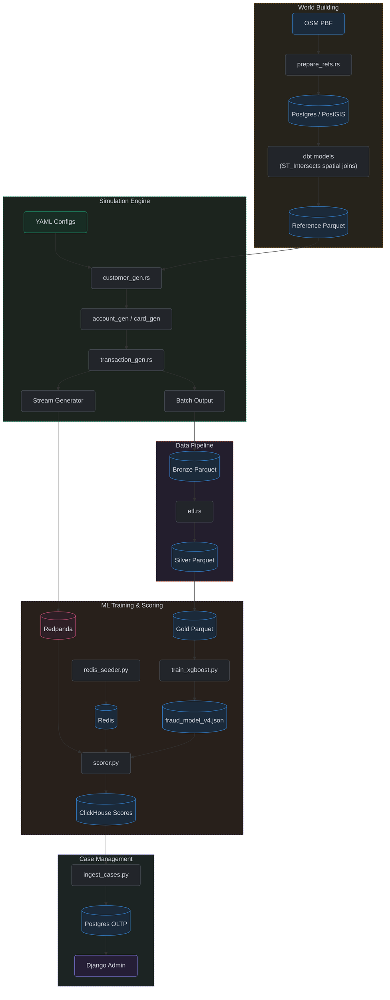

# Conceptual Explanations

High-level documentation explaining the underlying philosophy, architectural strategies, and simulation logic of RiskFabric.

## System Architecture Overview

**Figure 12:** System Architecture Overview

## Modules

- [Theory of Operation](theory_of_operation.md)
- [Fraud Signatures & Attack Patterns](fraud_signatures.md)
