# Storage Architecture Split

## Decision

Split RiskFabric's data storage across three workload-aligned tools instead of routing everything through ClickHouse and Postgres as catch-all engines. Move batch feature engineering and training data off ClickHouse entirely, leaving it as a streaming-only analytics engine. Introduce DuckDB as a zero-infrastructure query layer over Parquet snapshots for ML training. Keep Postgres for transactional state (case management, PostGIS, training metadata).

## Current architecture (what is being replaced)

```
Postgres: PostGIS + case management
ClickHouse: Bronze → Silver → Gold ETL + fraud_scores (streaming) + training data
Redis: real-time feature cache
```

ClickHouse serves two disjoint workloads: batch ETL/training (Bronze→Silver→Gold materialization) and streaming analytics (Kafka → scorer → fraud_scores → dashboard). The batch path writes Parquet to disk at generation, ingests it into ClickHouse, reads it back out for feature computation, and writes it back — a round-trip that exists only because ClickHouse is the default store. The streaming path is append-only and read-heavy at dashboard time, a natural fit for MergeTree.

Postgres holds case management but also absorbs cross-engine join burden — the dashboard and case admin both need to correlate ClickHouse scores with Postgres case state, requiring application-layer joins on `customer_id`.

## Target architecture

```
Postgres: PostGIS + case state (customer records, case status, investigator notes, assignments) + training metadata
ClickHouse: streaming ingestion → fraud_scores → dashboard queries
DuckDB: training queries over Gold Parquet snapshots (read-only, embedded, no server)
Redis: real-time feature cache (unchanged)
Redpanda: streaming message broker (unchanged)
```

Feature engineering moves from ClickHouse-backed ETL to a direct Parquet pipeline:

```mermaid
flowchart TB
    classDef script fill:#22252a,stroke:#4d535b,stroke-width:1px,rx:5px,ry:5px,color:#cfd2d9;
    classDef store fill:#1b2a3a,stroke:#304e70,stroke-width:1px,rx:5px,ry:5px,color:#cfd2d9;
    classDef ui fill:#251e36,stroke:#483a68,stroke-width:1px,rx:5px,ry:5px,color:#cfd2d9;
    subgraph BATCH["Batch Pipeline (Parquet)"]
        GEN[generate.rs]:::script --> BRONZE[("data/bronze/{date}/*.parquet")]:::store
        BRONZE --> POLARS["Polars\nfeature engineering"]:::script
        POLARS --> SILVER[("data/silver/{date}/*.parquet")]:::store
        SILVER --> DUCKDB["DuckDB\njoins Silver tables"]:::script
        DUCKDB --> GOLD[("data/gold/{snapshot}/*.parquet")]:::store
        GOLD --> TRAIN[train_xgboost.py]:::script
    end
    subgraph STREAM["Streaming Pipeline (unchanged)"]
        STREAM_RS[stream.rs]:::script --> RP[Redpanda]:::store
        RP --> SCORER[scorer.py]:::script
        SCORER --> CH[(ClickHouse\nfraud_scores)]:::store
        CH --> GRAFANA[Grafana]:::ui
    end

    style BATCH fill:#231e2d,stroke:#3f3354,stroke-width:1px,stroke-dasharray: 3 3,color:#cfd2d9
    style STREAM fill:#1c2423,stroke:#2e403d,stroke-width:1px,stroke-dasharray: 3 3,color:#cfd2d9
```



**<a id="fig-16"></a>Figure 16:** Storage Architecture Split — Parquet Pipeline

## Why this direction was chosen

**ClickHouse was the wrong tool for batch training data.** A columnar OLAP engine optimized for append-heavy analytical queries was being used as a mutable feature store. ClickHouse's slow/async ALTER TABLE UPDATE semantics and lack of point-in-time correctness make it unsuitable for reproducible training sets and correct backfills. The medallion architecture (Bronze → Silver → Gold) materialized three full copies of transaction data inside ClickHouse — data already stored as Parquet on disk from the generator — purely to satisfy an ETL pipeline that ran SQL against the database rather than Polars against files.

**DuckDB eliminates operational overhead for batch queries.** DuckDB is an embedded, in-process library, not a server. It reads Parquet natively with zero-copy columnar execution. There is no daemon to run, no port to expose, no container to maintain, and no connection pooling to configure. Training queries (full-table scans across 30+ feature columns) are a columnar workload — DuckDB handles them at performance comparable to ClickHouse (DuckDB p50: 1,616 ms vs ClickHouse p50: 2,039 ms on a 1.54M-row Parquet extraction query) — and with zero infrastructure cost. [[See benchmarks](performance.md)] And it supports point-in-time snapshots naturally: each training run points at a dated Parquet directory, making reproducibility trivial.

**Parquet-first pipeline removes wasted I/O.** The generator already writes Parquet to `data/output/`. The current pipeline then ingests those files into ClickHouse, reads them back into Polars for feature computation, and writes the result back to ClickHouse. The new pipeline cuts ClickHouse out of the loop entirely: Polars reads Bronze Parquet directly, computes features, and writes Gold Parquet. Bronze and Silver become files on disk rather than database tables, consistent with data lake patterns used in production data engineering.

**Postgres regains workload isolation.** Under the current architecture, Postgres handles case management CRUD alongside analytical queries that join across Postgres and ClickHouse. Under the new split, Postgres has three schemas — `location` (PostGIS), `case_state` (Django models), and `training` (run metadata) — all within one instance, but logically separated. Training data scanning millions of wide rows no longer competes with point-lookup case queries for buffer cache and I/O, because training data lives in Parquet, not in Postgres.

**The streaming path is untouched.** ClickHouse's real pipeline — Kafka → scorer → ClickHouse → dashboard — remains exactly as-is. ClickHouse serves a single, well-defined purpose: high-volume append-heavy analytics on live fraud scores. This is the workload MergeTree was designed for.

**Each tool now has one defensible reason for being there.** ClickHouse for streaming ingestion and aggregate dashboard queries, Postgres for transactional relational state, DuckDB for zero-infra columnar scans over files already generated, Redis for sub-millisecond feature lookups, Redpanda for stream buffering and replay. No tool does two things; no tool is a default hammer.

## What changes

- `src/bin/ingest.rs` — removed or repurposed (ClickHouse Bronze ingestion no longer needed)
- `src/bin/etl.rs` — Bronze→Silver→Gold stages decoupled from ClickHouse I/O; Polars reads/writes Parquet directly
- `src/summary/clickhouse.rs` — removed (dataset statistics move to DuckDB queries over Parquet)
- `build_gold_master.py` — rewritten to use DuckDB joins over Silver Parquet instead of ClickHouse SQL
- `train_xgboost.py` — reads Gold Parquet via DuckDB instead of ClickHouse `fraud_scores` table
- `seed_redis.py` — reads Gold Parquet via DuckDB instead of ClickHouse Gold table
- ClickHouse tables `fact_transactions_bronze`, `fact_transactions_silver`, `fact_transactions_gold`, and all dimension Silver tables are dropped
- Postgres gains `training` schema with `training_runs` table (snapshot path, model hash, metrics, timestamp)
- `documentation/decisions_index.md` updated with this decision

## What is retained

- ClickHouse `fraud_scores` table (streaming path, unchanged)
- All ClickHouse DDL for `fraud_scores` and operational tables
- `scorer.py` → ClickHouse write path (unchanged)
- Grafana → ClickHouse read path (replaces dashboard.py)
- Postgres `case_state` schema (Django models, unchanged)
- Postgres `location` schema (PostGIS, unchanged)
- Redis feature cache and `seed_redis.py` pattern (reads Gold Parquet instead of ClickHouse)
- Redpanda streaming broker (unchanged)
- `stream.rs` Kafka producer (unchanged)

## What is explicitly not changed

- Docker Compose service definitions (ClickHouse, Postgres, Redis, Redpanda, scorer, dashboard, case-admin all remain)
- The streaming data flow: `stream.rs → Redpanda → scorer.py → ClickHouse → dashboard`
- Monitoring infrastructure (Prometheus targets unchanged)
- The case management Django application

## Risks and mitigations

**Polars feature extraction must be extracted from etl.rs.** The current feature transforms in `src/etl/features/` are coupled to ClickHouse I/O. Extraction into standalone Polars functions reading/writing Parquet is a refactor, not a rewrite — the transform logic itself is portable — but it requires careful validation against existing Gold output to ensure feature parity.

**DuckDB vs ClickHouse benchmarked.** [[See measured comparison](performance.md)] DuckDB query (p50: 1,616 ms) is slightly faster than ClickHouse (p50: 2,039 ms) on the equivalent Gold Parquet extraction query — with zero infrastructure overhead (no daemon, no port, no container). The Gold join is now in Rust/Polars (`etl.rs`); this benchmark validates the training-data extraction path.

**Parquet snapshot storage must be durable.** Training snapshots must live on persistent storage, not ephemeral temp directories. Local development uses a `data/gold/{date}/` directory. Cloud deployment uses S3 with lifecycle policies (hot → warm → cold tiering).

**The streaming path has no training data dependency.** If the batch ETL pipeline is broken, the streaming scorer and dashboard continue to function — they depend only on Redpanda, Redis, and ClickHouse `fraud_scores`. This isolation is intentional and documented.
