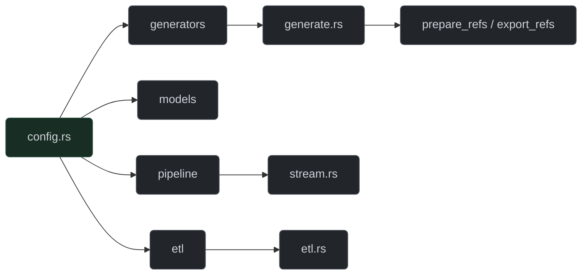

# Data Engineering & Warehouse

This section documents the ETL pipelines, warehouse ingestion utilities, and geographic reference preparation tools used to build the RiskFabric environment.

## Rust Core Engine (`src/`)

**Figure 4:** Rust Core Engine Module Map

## Modules

- [Feature Engineering Pipeline](components/etl_system.md)
- [Geospatial Reference Pipeline](components/dbt_models.md)
- [OSM Reference Extractor](components/reference_preparator.md)

