# RiskFabric

RiskFabric is an end-to-end fraud intelligence platform that generates synthetic financial data, trains XGBoost detection models, and scores transactions in real time against live behavioral patterns. It simulates the full lifecycle of customers, accounts, cards, and transactions with geographic fidelity sourced from OpenStreetMap, injects realistic fraud signatures, and surfaces flagged cases to analysts through a Django case management interface.

## ✨ Features
- **Synthetic Data Generation**: Rust-based generators create realistic customer profiles, accounts, cards, and transactions at scale, with configurable behavioral spend profiles and geographic distributions.
- **Geographic Realism**: OpenStreetMap reference points and H3 hexagonal indexing drive residential and merchant placement, with location-type-aware clustering (Metro/Urban/Rural) and ~500m spatial jitter to prevent coordinate clumping.
- **Fraud Injection Engine**: Simulates UPI scams, Account Takeover (ATO), and Card Not Present (CNP) fraud using configurable signatures that corrupt transaction metadata, amounts, channels, and temporal patterns (coordinated campaigns yet to be implemented).
- **Real-Time Scoring Pipeline**: Kafka consumer reads transaction streams, enriches with Redis feature lookups, runs XGBoost inference, and writes fraud scores to ClickHouse — all visible on Grafana dashboards with sub-second latency.
- **ML Training & Evaluation**: DuckDB queries against Gold Parquet tables feed XGBoost training with Platt/Isotonic calibration, SHAP feature analysis, data drift simulation, and leakage audits.
- **Analyst Case Management**: Flagged transactions are ingested into a PostgreSQL-backed Django admin with a state-machine review workflow (pending → investigating → confirmed fraud / cleared / false positive), notes, and SHAP explanations.

## 🛠️ Tech Stack
- **Core Engine**: Rust (Tokio, Polars, rdkafka, h3o, osmpbf, Rayon, serde, clap)
- **Real-time Streaming**: Redpanda (Kafka-compatible)
- **Data Processing**: Polars (batch ETL), DuckDB (embedded training queries), dbt + PostGIS (OSM enrichment)
- **Data Stores**: PostgreSQL + PostGIS (spatial staging), ClickHouse (real-time fraud scores), Redis (feature store), Parquet (Bronze/Silver/Gold)
- **Data Ingestion**: dlt (reference data export from Postgres to Parquet)
- **Machine Learning**: XGBoost (classifier), scikit-learn (evaluation, calibration), SHAP (feature explanation), NumPy, pandas
- **Real-time Scoring**: Kafka consumer → Redis lookups → XGBoost inference → ClickHouse writes
- **Dashboards**: Grafana (ClickHouse-backed)
- **Case Management**: Django 4.2 + Jazzmin — analyst review UI for investigating flagged transactions, updating case statuses, and recording dispositions
- **Infrastructure**: Docker Compose (7 services), Podman, Terraform (AWS)
- **Documentation**: mdBook

## 📁 Project Structure

### Root Directory

```d2
direction: down

classes: {
  root: {
    style.fill: "#1e232e"
    style.stroke: "#333e54"
    style.stroke-width: 2
    style.border-radius: 5
    style.font-color: "#cfd2d9"
    style.font-size: 28
  }
  eng: {
    style.fill: "#182d24"
    style.stroke: "#2b5443"
    style.stroke-width: 1
    style.border-radius: 5
    style.font-color: "#cfd2d9"
    style.font-size: 24
  }
  ml: {
    style.fill: "#28201b"
    style.stroke: "#4c392c"
    style.stroke-width: 1
    style.border-radius: 5
    style.font-color: "#cfd2d9"
    style.font-size: 24
  }
  geo: {
    style.fill: "#1b2a3a"
    style.stroke: "#304e70"
    style.stroke-width: 1
    style.border-radius: 5
    style.font-color: "#cfd2d9"
    style.font-size: 24
  }
  ops: {
    style.fill: "#2e1f26"
    style.stroke: "#573a46"
    style.stroke-width: 1
    style.border-radius: 5
    style.font-color: "#cfd2d9"
    style.font-size: 24
  }
  infra: {
    style.fill: "#1c2423"
    style.stroke: "#2e403d"
    style.stroke-width: 1
    style.border-radius: 5
    style.font-color: "#cfd2d9"
    style.font-size: 24
  }
  docs: {
    style.fill: "#251e36"
    style.stroke: "#483a68"
    style.stroke-width: 1
    style.border-radius: 5
    style.font-color: "#cfd2d9"
    style.font-size: 24
  }
  container_box: {
    style.stroke-dash: 3
    style.stroke-width: 1
    style.font-color: "#cfd2d9"
    style.font-size: 26
  }
}

ROOT: "📁 RiskFabric" {
  class: root
}

ROOT -> ENG -> ML_DATA -> OPS_INFRA -> DE_DOCS

ENG: "⚙️ Engine" {
  class: container_box
  style.fill: "#1c241e"
  style.stroke: "#304033"

  SRC: "src/ — Rust Core" {
    class: eng
  }
  CARGO: "Cargo.toml" {
    class: eng
  }
}

ML_DATA: "🧠 ML & Data" {
  class: container_box
  style.fill: "#231e2d"
  style.stroke: "#3f3354"

  SRC_ML: "src/ml/ — Python ML" {
    class: ml
  }
  MODELS: "models/ — XGBoost" {
    class: ml
  }
  REPORTS: "reports/ — SHAP" {
    class: ml
  }
  WH: "warehouse/ — dbt + PostGIS" {
    class: geo
  }
  DATA: "data/ — Configs + Parquet" {
    class: geo
  }
  DLT: "dlt/ — Data Load Tool" {
    class: geo
  }
}

OPS_INFRA: "☁️ Ops & Infra" {
  class: container_box
  style.fill: "#1c2423"
  style.stroke: "#2e403d"

  CASE: "case_admin/ — Django" {
    class: ops
  }
  DEPLOY: "deploy/ — Terraform + AWS" {
    class: infra
  }
  DOCKER: "docker-compose.yml" {
    class: infra
  }
}

DE_DOCS: "📖 Docs" {
  class: container_box
  style.fill: "#251e36"
  style.stroke: "#483a68"

  DOCS: "documentation/ — mdBook" {
    class: docs
  }
  BOOK: "book/ — Compiled HTML" {
    class: docs
  }
}
```

### Docker Services

```mermaid
%%{init: {
  'themeVariables': {
    'fontFamily': '"JetBrains Mono", monospace'
  }
}}%%
flowchart LR
    classDef olap fill:#182d24,stroke:#2b5443,stroke-width:1px,rx:5px,ry:5px,color:#cfd2d9;
    classDef stream fill:#2e1f26,stroke:#573a46,stroke-width:1px,rx:5px,ry:5px,color:#cfd2d9;
    classDef store fill:#1b2a3a,stroke:#304e70,stroke-width:1px,rx:5px,ry:5px,color:#cfd2d9;
    classDef app fill:#28201b,stroke:#4c392c,stroke-width:1px,rx:5px,ry:5px,color:#cfd2d9;
    classDef oltp fill:#1c2423,stroke:#2e403d,stroke-width:1px,rx:5px,ry:5px,color:#cfd2d9;

    CH["🏛️ ClickHouse\nStreaming Scores\nPort 8123"]:::olap
    REDPANDA["📨 Redpanda\nKafka Broker\nPort 9092"]:::stream
    REDIS["🔴 Redis\nFeature Store\nPort 6379"]:::store
    PG_OLTP["🗄️ Postgres (OLTP)\nCase Admin DB\nPort 5433"]:::oltp
    PG_GEO["🗄️ Postgres (PostGIS)\nOSM Geo DB\nPort 5432"]:::store
    DJANGO["💻 Django Admin\nCase Management UI\nPort 8001"]:::app
    DSBOARD["📊 Grafana\nReal-time Monitoring\nPort 3000"]:::app

    CH --- REDPANDA --- REDIS --- PG_OLTP --- PG_GEO --- DJANGO --- DSBOARD

    style CH fill:#182d24,stroke:#2b5443,stroke-width:1.5px,color:#cfd2d9;
    linkStyle default stroke-width:1px,stroke:#5c687a
```


*Developed by harshafaik*
