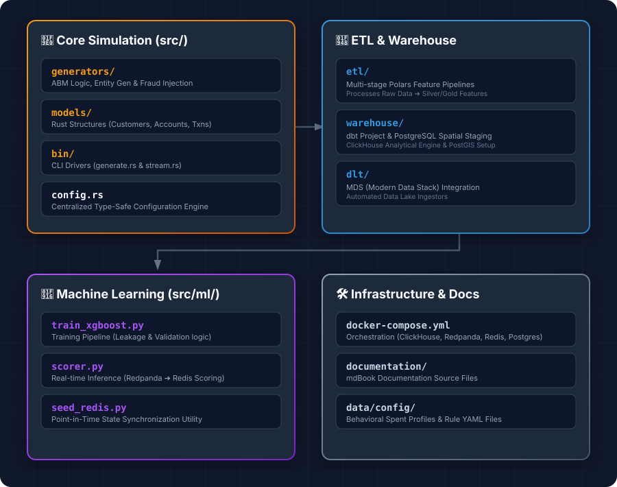

# RiskFabric

RiskFabric is a fraud intelligence platform designed for building fraud detection models using synthetic financial records. 

## ✨ Features
- **Agent-Based Realism**: Simulates the full lifecycle of `Customers`, `Accounts`, and `Cards`, with behavioral spend profiles driven by real-world heuristics.
- **Geographic Fidelity**: Integrates **OpenStreetMap (OSM)** and **H3** hexagonal indexing for realistic spatial spend patterns and location anomalies.
- **Sophisticated Fraud Injection**: Includes signatures for UPI Scams, Account Takeover (ATO), Card Not Present (CNP) fraud, and coordinated campaigns(yet to be implemented).

## 🛠️ Tech Stack
- **Core Engine**: Rust 
- **Real-time Streaming**: Redpanda (Kafka-compatible), `rdkafka`, and Tokio async runtime.
- **Data Processing**: Polars
- **Data Warehouse**: PostgreSQL (Spatial/OSM staging), ClickHouse (Synthetic financial data), and dbt (Analytical enrichment).
- **Feature Store**: Redis
- **Data Ingestion**: `dlt` (Data Load Tool) for MDS integration.
- **Machine Learning**: XGBoost
- **Infrastructure**: Docker/Podman

## 📁 Project Structure

*Developed by harshafaik*
