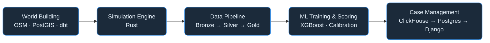

# RiskFabric


RiskFabric is a fraud intelligence platform designed for building fraud detection models using synthetic financial records.

## System Pipeline



**<a id="fig-1"></a>Figure 1:** System Pipeline — high-level data flow from world building through case management.

## ✨ Features
- **Agent-Based Realism**: Simulates the full lifecycle of `Customers`, `Accounts`, and `Cards`, with behavioral spend profiles driven by real-world heuristics and deterministic seeded RNG for reproducibility.
- **Geographic Fidelity**: Integrates **OpenStreetMap (OSM)** and **H3** hexagonal indexing for realistic spatial spend patterns and location anomalies.
- **Sophisticated Fraud Injection**: Includes signatures for UPI Scams, Account Takeover (ATO), Card Not Present (CNP) fraud, friendly fraud, velocity abuse, and coordinated campaigns via the adversary logic engine.
- **Real-time Scoring**: Kafka/Redpanda consumer with Redis feature store, XGBoost inference, and ClickHouse persistence.
- **Model Explainability**: SHAP global and per-profile analysis, calibration (Platt/Isotonic), drift simulation, and a Streamlit evaluation dashboard.
- **Case Management**: Django admin panel backed by a dedicated PostgreSQL OLTP store for investigator review workflows.
- **Parquet-native ETL**: Medallion architecture (bronze → silver → gold) with no-leak expanding-window features and dbt analytical models.

## 🛠️ Tech Stack
- **Core Engine**: Rust (generators, ETL, pipeline, streaming)
- **Real-time Streaming**: Redpanda (Kafka-compatible), `rdkafka`, and Tokio async runtime
- **Data Processing**: Polars (batch/streaming feature engineering)
- **Data Warehouse**: Parquet (medallion ETL via Polars) → DuckDB (embedded training query engine) → dbt (analytical enrichment)
- **Analytical Store**: ClickHouse (fraud scores, Grafana dashboards)
- **Operational Store**: PostgreSQL (case management OLTP)
- **Feature Store**: Redis (real-time feature serving)
- **Machine Learning**: XGBoost (training, inference), SHAP (explainability), Scikit-learn (calibration), Streamlit (evaluation dashboard)
- **Infrastructure**: Podman/Docker Compose, Terraform (GCP deployment)
- **Docs**: mdBook (published via GitHub Actions)

## 🚀 Quick Start

```bash
# Build
cargo build --release

# Generate synthetic data (customers, accounts, cards, transactions)
cargo run --bin generate

# Run the Parquet-native ETL pipeline (bronze → silver → gold)
cargo run --bin riskfabric-etl silver-all
cargo run --bin riskfabric-etl gold-master

# Train + evaluate the XGBoost model
python src/ml/train_xgboost.py
python src/ml/test_model.py

# Launch the Streamlit evaluation dashboard
podman compose exec scorer streamlit run src/ml/dashboard.py

# Start the full stack (ClickHouse, Redpanda, Redis, scorer, case-admin, Grafana)
podman compose up --build -d
```

## 📁 Project Structure

### Root Directory

```
📁 RiskFabric
 │
 ├─ ⚙️ Engine
 │   ├─ src/ — Rust Core (generators, ETL, pipeline)
 │   └─ Cargo.toml
 │
 ├─ 🧠 ML & Data
 │   ├─ src/ml/ — Python ML (training, scoring, explainability)
 │   ├─ models/ — XGBoost artifacts
 │   ├─ reports/ — SHAP analysis outputs
 │   ├─ warehouse/ — dbt models + PostGIS refs
 │   ├─ data/ — Configs, Parquet inputs/outputs
 │   └─ dlt/ — Data Load Tool pipelines
 │
 ├─ ☁️ Ops & Infra
 │   ├─ case_admin/ — Django admin (case management)
 │   ├─ deploy/ — Terraform (GCP deployment)
 │   ├─ docker/ — ClickHouse init, Grafana provisioning
 │   └─ docker-compose.yml
 │
 └─ 📖 Docs (documentation/ — mdBook)
```

## Modules

- [Data Generation Modules](simulation_index.md)
- [Data & Engineering](engineering_index.md)
- [Machine Learning Systems](ml_systems_index.md)
- [Infrastructure & Operations](infrastructure_index.md)
- [Conceptual Explanations](concepts_index.md)
- [Results & Monitoring](results_index.md)
- [Decisions](decisions_index.md)
- [Defunct Implementations](defunct_index.md)
- [Codebase Components](components/index.md)

---

*Developed by harshafaik*
