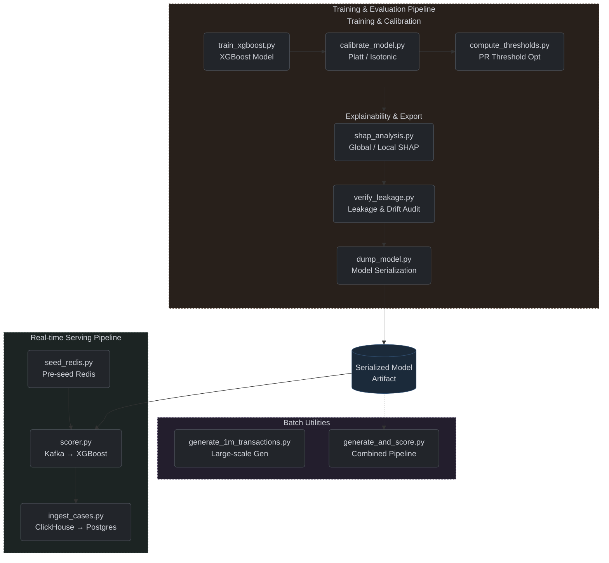

# Machine Learning Systems

This section documents the model training pipelines, real-time inference services, and metadata utilities required for detecting synthetic fraud patterns.

## Python ML Pipeline (`src/ml/`)

**Figure 7:** Python ML Pipeline

## Modules

- [Training Pipeline](components/ml_training.md)
- [Model Calibration](components/ml_calibration.md)
- [Real-Time Scoring Service](components/realtime_scorer.md)
- [Model Explainability (SHAP)](components/ml_explainability.md)
- [Model Robustness & Drift](components/ml_robustness.md)
- [Analysis & Utility Scripts](ml_analysis_scripts.md)
