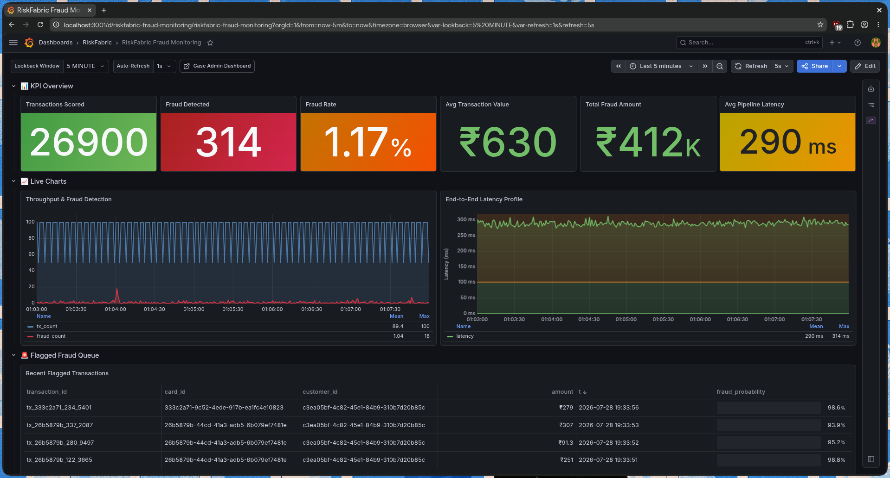

# Results & Monitoring

Tracking the evolution of model performance, generation throughput, and ETL efficiency benchmarks.

**Figure 14:** Grafana Fraud Monitoring Dashboard — real-time score distributions, volume trends, and alert overview.

## Modules

- [Machine Learning Metrics](ml_metrics.md)
- [Feature Leakage Case Study](feature_leakage_issues.md)
- [Performance Benchmarks](performance.md)

