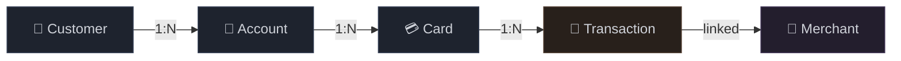

# Theory of Operation

This document explains the underlying philosophy, architecture, and logic of the RiskFabric simulation. It answers the question: "How does the engine actually think?"

## 1. Agent-Based Simulation (ABM) Philosophy
RiskFabric functions as an **Agent-Based Simulator** rather than a simple random data generator. 

```mermaid
%%{init: {
  'themeVariables': {
    'fontFamily': '"JetBrains Mono", monospace'
  }
}}%%
flowchart TD
    %% Node Class Definitions
    classDef script fill:#22252a,stroke:#4d535b,stroke-width:1px,rx:5px,ry:5px,color:#cfd2d9;
    classDef store fill:#1b2a3a,stroke:#304e70,stroke-width:1px,rx:5px,ry:5px,color:#cfd2d9;
    classDef config fill:#182d24,stroke:#2b5443,stroke-width:1px,rx:5px,ry:5px,color:#cfd2d9;
    classDef stream fill:#2e1f26,stroke:#573a46,stroke-width:1px,rx:5px,ry:5px,color:#cfd2d9;
    classDef ui fill:#251e36,stroke:#483a68,stroke-width:1px,rx:5px,ry:5px,color:#cfd2d9;

    subgraph WB["🌍 World Building"]
        OSM["🗺️ OSM PBF"]:::store
        PR["⚙️ prepare_refs.rs"]:::script
        PG[("🗄️ Postgres / PostGIS")]:::store
        DBT["📊 dbt models"]:::script
        ER["⚙️ export_references.rs"]:::script
        REF[("📂 Reference Parquet")]:::store

        OSM --> PR --> PG --> DBT --> ER --> REF
    end

    subgraph CFG["⚙️ Configuration"]
        YAML["📄 YAML Configs"]:::store
        CFG_RS["⚙️ config.rs"]:::script

        YAML --> CFG_RS
    end

    subgraph SIM["⚡ Simulation Engine"]
        CUST["👤 customer_gen.rs"]:::script
        ACC["💳 account_gen.rs / card_gen.rs"]:::script
        TXN["💸 transaction_gen.rs"]:::script
        ALE["🤖 fraud.rs"]:::script
        BATCH["📦 batch generator"]:::script
        STREAM["📥 stream generator"]:::script

        CFG_RS --> CUST
        CFG_RS --> ACC
        CFG_RS --> TXN
        CFG_RS --> ALE

        REF --> CUST
        REF --> ACC

        CUST --> ACC
        ACC --> TXN
        ALE --> TXN

        TXN --> BATCH
        TXN --> STREAM
    end

    subgraph WH["🏛️ Data Pipeline (Parquet)"]
        BRONZE[("🥉 Bronze Parquet")]:::store
        ETL["⚙️ etl.rs"]:::script
        SILVER[("🥈 Silver Parquet")]:::store
        GOLD[("🥇 Gold Parquet")]:::store

        BATCH --> BRONZE --> ETL --> SILVER --> GOLD
    end

    subgraph ML["🧠 ML & Scoring"]
        TRAIN["🏋️ ml_training"]:::script
        MODEL["🎯 fraud model"]:::store
        SCORER["⚡ realtime_scorer"]:::script
        KAFKA[("📨 Redpanda (Kafka)")]:::stream
        SEED["🌱 redis_seeder"]:::script
        REDIS[("🔴 Redis Cache")]:::store
        SCORES[("📊 ClickHouse Scores")]:::store

        GOLD --> TRAIN --> MODEL --> SCORER
        STREAM --> KAFKA --> SCORER
        SEED --> REDIS --> SCORER
        SCORER --> SCORES
    end

    subgraph CM["📋 Case Management"]
        IC["⚙️ ingest_cases"]:::script
        PGO[("🗄️ Postgres (OLTP)")]:::store
        DJANGO["💻 Django Case Admin"]:::ui

        SCORES --> IC --> PGO --> DJANGO
    end

    %% Subgraph Styling
    style WB fill:#26231b,stroke:#474130,stroke-width:1px,stroke-dasharray: 3 3,color:#cfd2d9;
    style CFG fill:#1e232e,stroke:#333e54,stroke-width:1px,stroke-dasharray: 3 3,color:#cfd2d9;
    style SIM fill:#1c241e,stroke:#304033,stroke-width:1px,stroke-dasharray: 3 3,color:#cfd2d9;
    style WH fill:#231e2d,stroke:#3f3354,stroke-width:1px,stroke-dasharray: 3 3,color:#cfd2d9;
    style ML fill:#28201b,stroke:#4c392c,stroke-width:1px,stroke-dasharray: 3 3,color:#cfd2d9;
    style CM fill:#1c2423,stroke:#2e403d,stroke-width:1px,stroke-dasharray: 3 3,color:#cfd2d9;
```



- **The Agent**: The primary agent, the `Customer`, drives the logic.
- **The World**: **OpenStreetMap (OSM)** reference nodes (Residential and Merchant points) across India define the physical world.
- **The Rules**: Agents follow deterministic rules defined in `fraud_rules.yaml` and `transaction_config.yaml`.

Unlike statistical generators that sample from distributions to create flat tables, RiskFabric simulates the **lifecycle** of financial entities.


## 2. The Deterministic Lifecycle
To ensure consistency across 10M rows and all tables, RiskFabric follows a strict creation order:



1.  **Customer Birth**: The generator assigns each customer a name, age, and a **Home Coordinate** based on real residential OSM nodes.
2.  **Financial Anchoring**: The system assigns one or more `Accounts` to every customer.
3.  **Payment Instruments**: Accounts issue `Cards`. These cards act as "keys" for generating transaction streams.
4.  **The Spend Loop**: Each card generates transactions based on the customer's `monthly_spend` profile.


## 3. The "One-Pass" Parallel Architecture
Traditional simulators often use multiple passes (e.g., Pass 1: Generate legitimate data, Pass 2: Inject fraud). This approach increases latency and memory usage.

RiskFabric uses a **One-Pass Architecture** in Rust:
- **Parallelization**: The engine uses the `Rayon` library to process thousands of entities simultaneously across all CPU cores.
- **Unified Logic**: Merchant selection, amount calculation, fraud injection, and campaign coordination occur in a **single loop**.
- **Memory Efficiency**: By using "Batched Generation" (5,000 entities per cycle), the engine maintains a constant memory footprint whether generating 1M or 10M rows.


## 4. Spatial Realism & H3 Indexing
RiskFabric uses geographic high-fidelity. 

- **H3 Hierarchies**: The system uses Uber's H3 hexagonal grid. Customers are indexed at Resolution 7 (~5 km² per cell). When a user spends, the engine parents to Resolution 6 (~36 km²) for local merchant matching and Resolution 4 for wider fallback searches.
- **Local vs. Global Spend**: Legitimate transactions remain "local" (same H3 cell) approximately 98% of the time. Fraud profiles (like UPI Scams) explicitly force "Remote" coordinates to simulate offshore or cross-state attacks.


## 5. Statistical Reproducibility (Seeded PRNG)
Every card in the system has a **Deterministic Seed**. 

```rust
let mut card_rng = StdRng::seed_from_u64(base_seed ^ salt ^ (i as u64));
```

Running the simulation with the same `base_seed` ensures every transaction for a given card remains identical. This enables **Machine Learning reproducibility**, allowing for feature adjustments without the underlying ground-truth shifting.


## 6. Simulated Imperfection (Label Noise)
To mirror real-world banking challenges, RiskFabric implements **Noisy Labeling**:
- **Ground Truth (`fraud_target`)**: The latent indicator of whether the generator injected a specific fraud pattern.
- **Noisy Label (`is_fraud`)**: The signal typically available to a bank's operational systems. It includes False Positives (legitimate transactions flagged as fraud) and False Negatives (undetected fraudulent transactions).

This design forces models to learn robustness and generalizable patterns rather than memorizing perfect synthetic signatures.


## 7. Hybrid Streaming & Verification Architecture
To support real-time fraud detection, RiskFabric includes a dedicated **Streaming Generator** that bridges the gap between static datasets and live production environments.

- **One-Pass Consistency**: The streaming engine reuses the exact same logic as the batch pipeline but operates on a continuous loop, producing transactions at a configurable rate (default 100 tx/s).
- **Type-Level Safety (Unlabeled Output)**: To prevent "label leakage" during live scoring, the system uses a specialized `UnlabeledTransaction` struct. This mirrors the standard transaction but programmatically omits all ground-truth and labeling fields (`is_fraud`, `chargeback`, etc.), ensuring the Kafka payload is consistent with a real production stream.
- **Verification Mode**: While in verification mode, the generator writes the "Ground Truth" of every streaming transaction to `ground_truth.csv`. This allows for a post-hoc join against real-time model scores to measure precision and recall in a simulated production environment.
- **Self-Correcting Rate Limiter**: The generator measures actual Kafka broker latency for every message sent. It dynamically adjusts its sleep interval to compensate for network jitter, ensuring steady, drift-free throughput over long durations.
